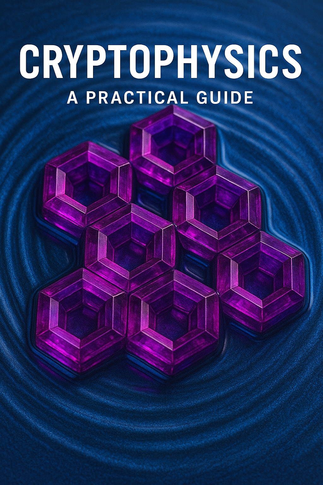

# Cryptophysics: A Practical Guide


BY VERONICA HODO

REVISION 2

## Table of Contents

- [Cryptophysics: A Practical Guide](#cryptophysics-a-practical-guide)
  - [Table of Contents](#table-of-contents)
  - [Preface — A Line in Time](#preface--a-line-in-time)
  - [A Moment in Context](#a-moment-in-context)
  - [Why This Book Exists](#why-this-book-exists)
  - [The Birth of a Discipline](#the-birth-of-a-discipline)
  - [A Personal Note](#a-personal-note)
  - [What You Will Gain](#what-you-will-gain)
  - [Chapter 1 — Time as Substrate](#chapter-1--time-as-substrate)
    - [1.1 The Hidden Foundation Beneath Every System](#11-the-hidden-foundation-beneath-every-system)
    - [1.2 Sidereal vs Solar: Choosing the Right Clock](#12-sidereal-vs-solar-choosing-the-right-clock)
    - [1.3 Turns, Marks, Submarks, and Micromarks](#13-turns-marks-submarks-and-micromarks)
    - [1.4 Temporal Precision and Causality](#14-temporal-precision-and-causality)
    - [1.5 Time as a Cryptographic Primitive](#15-time-as-a-cryptographic-primitive)
    - [1.6 Escaping the Calendar Trap](#16-escaping-the-calendar-trap)
    - [1.7 The Genesis Anchor](#17-the-genesis-anchor)
    - [1.8 Temporal Substrate vs Timestamping](#18-temporal-substrate-vs-timestamping)
    - [1.9 Implementation: Computing Genesis Time](#19-implementation-computing-genesis-time)
      - [Coordinate System](#coordinate-system)
      - [Definitions](#definitions)
      - [Goal](#goal)
      - [Step-by-Step Calculation (Integer Arithmetic)](#step-by-step-calculation-integer-arithmetic)
      - [1.9.1 Elapsed Time Since Genesis](#191-elapsed-time-since-genesis)
      - [1.9.2 Compute Total Micromarks Since Genesis](#192-compute-total-micromarks-since-genesis)
        - [Deriving Turn.Mark.Submark.Micromark (Display Only)](#deriving-turnmarksubmarkmicromark-display-only)
      - [1.9.3 Turn](#193-turn)
      - [1.9.4 Mark](#194-mark)
      - [1.9.5 Submark](#195-submark)
      - [Final Display Format](#final-display-format)
      - [Practical Notes (Non-Magical)](#practical-notes-non-magical)
    - [1.10 Philosophical Implications: A Shared Clock for Civilization](#110-philosophical-implications-a-shared-clock-for-civilization)
    - [1.11 Looking Ahead](#111-looking-ahead)
  - [Chapter 2 — The Lattice: An Informational Time Crystal](#chapter-2--the-lattice-an-informational-time-crystal)
    - [2.1 Beyond Databases: A Different Ontology](#21-beyond-databases-a-different-ontology)
    - [2.2 The Informational Time Crystal](#22-the-informational-time-crystal)
    - [2.3 The Lattice Schema: The R⬢ Form](#23-the-lattice-schema-the-r-form)
    - [2.4 Hash Linking: Causality in Practice](#24-hash-linking-causality-in-practice)
    - [2.5 Temporal Anchoring: Where Causality Meets Physics](#25-temporal-anchoring-where-causality-meets-physics)
    - [2.6 Append-Only Semantics](#26-append-only-semantics)
    - [2.7 R⬢ Size and Practical Constraints](#27-r-size-and-practical-constraints)
    - [2.8 Distributed Replication and Convergence](#28-distributed-replication-and-convergence)
    - [2.9 Verification from First Principles](#29-verification-from-first-principles)
    - [2.10 Temporal Hash Chains vs. Blockchains](#210-temporal-hash-chains-vs-blockchains)
    - [2.11 The Lattice as a Causal Fabric](#211-the-lattice-as-a-causal-fabric)
    - [2.12 Looking Ahead](#212-looking-ahead)
  - [Chapter 3 — Scopes: Structuring the Infinite](#chapter-3--scopes-structuring-the-infinite)
    - [3.1 Space to Match Time](#31-space-to-match-time)
    - [3.2 Defining a Scope](#32-defining-a-scope)
    - [3.3 Parent and Child Enforcement](#33-parent-and-child-enforcement)
    - [3.4 Infinite Parallelism](#34-infinite-parallelism)
    - [3.5 Naming as Addressing (Integer Micromarks)](#35-naming-as-addressing-integer-micromarks)
      - [Routing Without Resolvers](#routing-without-resolvers)
    - [3.6 Policing Policies Within Scopes](#36-policing-policies-within-scopes)
    - [3.7 Scoped Authority and Delegation](#37-scoped-authority-and-delegation)
    - [3.8 Scope Lifecycle](#38-scope-lifecycle)
    - [3.9 Uniqueness Guarantees and Collisions](#39-uniqueness-guarantees-and-collisions)
    - [3.10 Scope Hierarchies as Spatial Trees](#310-scope-hierarchies-as-spatial-trees)
    - [3.11 Why Scopes Matter](#311-why-scopes-matter)
    - [3.12 Looking Ahead](#312-looking-ahead)
  - [Chapter 4 — Ushering R⬢: Temporal and Spatial Anchoring](#chapter-4--ushering-r-temporal-and-spatial-anchoring)
    - [4.1 The Role of the Usher](#41-the-role-of-the-usher)
    - [4.2 Temporal and Spatial Coordinates](#42-temporal-and-spatial-coordinates)
    - [4.3 The Usher’s Dual Identity: Transport and Authority](#43-the-ushers-dual-identity-transport-and-authority)
    - [4.4 Usher Keys and Authorization](#44-usher-keys-and-authorization)
    - [4.5 Temporal and Spatial Placement](#45-temporal-and-spatial-placement)
    - [4.6 Routing by Scope and Spatial Frame](#46-routing-by-scope-and-spatial-frame)
    - [4.7 Signature Assembly and Finalization](#47-signature-assembly-and-finalization)
    - [4.8 Caching and Forwarding](#48-caching-and-forwarding)
    - [4.9 Multi-Usher Scopes and Quorum Admission](#49-multi-usher-scopes-and-quorum-admission)
    - [4.10 Revocation and Rotation](#410-revocation-and-rotation)
    - [4.11 Failure Modes and Byzantine Behavior](#411-failure-modes-and-byzantine-behavior)
    - [4.12 Ushers vs. Miners and Validators](#412-ushers-vs-miners-and-validators)
    - [4.13 Why Ushers Matter](#413-why-ushers-matter)
    - [4.14 Looking Ahead](#414-looking-ahead)
  - [Chapter 5 — Authoring with Intent](#chapter-5--authoring-with-intent)
    - [5.1 The Intent Substructure](#51-the-intent-substructure)
      - [Binding, in Plain Terms](#binding-in-plain-terms)
      - [Why Binding Exists](#why-binding-exists)
      - [Deterministic Propositions](#deterministic-propositions)
      - [Why This Matters](#why-this-matters)
    - [5.2 `previous_hash` — Anchoring to History](#52-previous_hash--anchoring-to-history)
    - [5.3 `scope` — The Namespace Anchor](#53-scope--the-namespace-anchor)
    - [5.4 `nonce` — Entropy for Uniqueness](#54-nonce--entropy-for-uniqueness)
    - [5.5 `author_public_key` — Declaring Identity](#55-author_public_key--declaring-identity)
    - [5.6 `usher_public_key` — Declaring Gatekeeper](#56-usher_public_key--declaring-gatekeeper)
    - [5.7 `schema` — The Shape of the Data](#57-schema--the-shape-of-the-data)
      - [Schemas as References, Not Files](#schemas-as-references-not-files)
      - [Self-Referential vs External Schemas](#self-referential-vs-external-schemas)
      - [Why the Schema Field Matters](#why-the-schema-field-matters)
      - [An Open Frontier](#an-open-frontier)
    - [5.8 `record_type` — Defining the Verb](#58-record_type--defining-the-verb)
    - [5.9 `data` — Structured Flexibility](#59-data--structured-flexibility)
      - [Payload Forms, Intentionally Limited](#payload-forms-intentionally-limited)
      - [Schemas Define Meaning, Not Code](#schemas-define-meaning-not-code)
      - [Mixed Payloads and Real Systems](#mixed-payloads-and-real-systems)
      - [From Data to Law](#from-data-to-law)
    - [5.10 Cryptographic Implications of Intent](#510-cryptographic-implications-of-intent)
      - [🧠 Step 1 — Author Hashes and Signs Intent](#-step-1--author-hashes-and-signs-intent)
      - [⏱ Step 2 — Usher Hashes Author Signature and Signs](#-step-2--usher-hashes-author-signature-and-signs)
      - [🧑‍⚖️ Step 3 — Quorum Hashes Author + Usher Signatures](#️-step-3--quorum-hashes-author--usher-signatures)
      - [🌀 Step 4 — Finalization via `current_hash`](#-step-4--finalization-via-current_hash)
      - [🔐 Signature Ordering and Determinism](#-signature-ordering-and-determinism)
      - [🔐 Cryptographic Implications](#-cryptographic-implications)
    - [5.11 Summary](#511-summary)
  - [Chapter 6 — SigilID: Sovereign Identity in Temporal Space](#chapter-6--sigilid-sovereign-identity-in-temporal-space)
    - [6.1 The Sigil Root Scope](#61-the-sigil-root-scope)
    - [6.2 Generating a SigilID](#62-generating-a-sigilid)
    - [6.3 Special Ushers: Neutral Identity Issuance](#63-special-ushers-neutral-identity-issuance)
    - [6.4 SigilID Structure](#64-sigilid-structure)
    - [6.5 Deterministic ID Computation](#65-deterministic-id-computation)
    - [6.6 Why the Sigil Usher Pool Matters](#66-why-the-sigil-usher-pool-matters)
    - [6.7 Using Your SigilID](#67-using-your-sigilid)
    - [6.8 Attestations and Trust Graphs](#68-attestations-and-trust-graphs)
    - [6.9 Privacy and Projection](#69-privacy-and-projection)
    - [6.10 Comparison to Traditional Identity Systems](#610-comparison-to-traditional-identity-systems)
    - [6.11 Lifecycle of a SigilID](#611-lifecycle-of-a-sigilid)
    - [6.12 Why SigilID Matters](#612-why-sigilid-matters)
    - [6.13 Looking Ahead](#613-looking-ahead)
  - [Chapter 7 — VeroScope: Pattern Recognition on Transparent History](#chapter-7--veroscope-pattern-recognition-on-transparent-history)
    - [7.1 From Lattice to Insight](#71-from-lattice-to-insight)
    - [7.2 What VeroScope Is (and Is Not)](#72-what-veroscope-is-and-is-not)
    - [7.3 Reflexive Intelligence](#73-reflexive-intelligence)
    - [7.4 Explainability by Design](#74-explainability-by-design)
    - [7.5 Observations as First-Class Records](#75-observations-as-first-class-records)
    - [7.6 Analytical Domains](#76-analytical-domains)
    - [7.7 Distributed VeroScope](#77-distributed-veroscope)
    - [7.8 Temporal Windows and Incremental Analysis](#78-temporal-windows-and-incremental-analysis)
    - [7.9 Model Evolution and Versioning](#79-model-evolution-and-versioning)
    - [7.10 Reflexive Feedback Loops](#710-reflexive-feedback-loops)
    - [7.11 Ethical and Epistemic Implications](#711-ethical-and-epistemic-implications)
    - [7.12 Why VeroScope Matters](#712-why-veroscope-matters)
    - [7.13 Looking Ahead](#713-looking-ahead)
  - [Chapter 8 — Cryptophysics in Practice](#chapter-8--cryptophysics-in-practice)
    - [8.1 From Principles to Practice](#81-from-principles-to-practice)
    - [8.2 Identity Verification: Replacing Credentials with Coordinates](#82-identity-verification-replacing-credentials-with-coordinates)
      - [Step-by-Step](#step-by-step)
    - [8.3 Supply Chain Provenance: Immutable Logistics](#83-supply-chain-provenance-immutable-logistics)
      - [Example: Electric Motor Manufacturing](#example-electric-motor-manufacturing)
    - [8.4 Social Networks: Anti-Revisionist Communication](#84-social-networks-anti-revisionist-communication)
      - [Pattern](#pattern)
    - [8.5 Governance: Transparent Decision-Making](#85-governance-transparent-decision-making)
      - [Example: Municipal Governance](#example-municipal-governance)
    - [8.6 Post-Scarcity Logistics](#86-post-scarcity-logistics)
      - [Pattern](#pattern-1)
    - [8.7 Building on the Lattice: A Developer’s Guide](#87-building-on-the-lattice-a-developers-guide)
    - [8.8 Common Patterns and Pitfalls](#88-common-patterns-and-pitfalls)
    - [8.9 Why Practice Matters](#89-why-practice-matters)
    - [8.10 Looking Ahead](#810-looking-ahead)
  - [Chapter 9 — Governance and Stewardship](#chapter-9--governance-and-stewardship)
    - [9.1 Governance in a Transparent Substrate](#91-governance-in-a-transparent-substrate)
    - [9.2 Scopes as Governance Domains](#92-scopes-as-governance-domains)
    - [9.3 Quorum Signatures: Collective Authority](#93-quorum-signatures-collective-authority)
      - [Example](#example)
    - [9.4 Authority Delegation and Key Hierarchies](#94-authority-delegation-and-key-hierarchies)
    - [9.5 Policy R⬢: The Rule of Code](#95-policy-r-the-rule-of-code)
    - [9.6 The Hodo Trust Ethos](#96-the-hodo-trust-ethos)
    - [9.7 Post-Scarcity vs Scarcity Governance](#97-post-scarcity-vs-scarcity-governance)
    - [9.8 Governance Through Scopes and Delegation Trees](#98-governance-through-scopes-and-delegation-trees)
    - [9.9 VeroScope Oversight and Auditing](#99-veroscope-oversight-and-auditing)
    - [9.10 Stewardship vs Control](#910-stewardship-vs-control)
    - [9.11 Governance Failure Modes](#911-governance-failure-modes)
    - [9.12 Why Governance and Stewardship Matter](#912-why-governance-and-stewardship-matter)
    - [9.13 Looking Ahead](#913-looking-ahead)
  - [Chapter 10 — Disruption: The Five Pillars](#chapter-10--disruption-the-five-pillars)
    - [10.1 The Architecture of Pillars](#101-the-architecture-of-pillars)
    - [10.2 War: Deterrence Through Transparency](#102-war-deterrence-through-transparency)
      - [Traditional Paradigm](#traditional-paradigm)
      - [Cryptophysical Shift](#cryptophysical-shift)
      - [Applications](#applications)
    - [10.3 Wealth: Refactoring Economics Through Transparency](#103-wealth-refactoring-economics-through-transparency)
      - [Traditional Paradigm](#traditional-paradigm-1)
      - [Cryptophysical Shift](#cryptophysical-shift-1)
      - [Applications](#applications-1)
    - [10.4 Food: Global Provenance and Post-Scarcity Distribution](#104-food-global-provenance-and-post-scarcity-distribution)
      - [Traditional Paradigm](#traditional-paradigm-2)
      - [Cryptophysical Shift](#cryptophysical-shift-2)
      - [Applications](#applications-2)
    - [10.5 Energy: Transparent Infrastructure for Abundance](#105-energy-transparent-infrastructure-for-abundance)
      - [Traditional Paradigm](#traditional-paradigm-3)
      - [Cryptophysical Shift](#cryptophysical-shift-3)
      - [Applications](#applications-3)
    - [10.6 Medicine: Trustworthy Knowledge and Care](#106-medicine-trustworthy-knowledge-and-care)
      - [Traditional Paradigm](#traditional-paradigm-4)
      - [Cryptophysical Shift](#cryptophysical-shift-4)
      - [Applications](#applications-4)
    - [10.7 Scarcity as Design Choice](#107-scarcity-as-design-choice)
    - [10.8 Why Disruption Matters](#108-why-disruption-matters)
    - [10.9 Looking Ahead](#109-looking-ahead)
  - [Chapter 11 — Building the Future](#chapter-11--building-the-future)
    - [11.1 From Reader to Steward](#111-from-reader-to-steward)
    - [11.2 The Steward’s Ethos](#112-the-stewards-ethos)
    - [11.3 Joining the Lattice](#113-joining-the-lattice)
    - [11.4 Contributing to Open Protocols](#114-contributing-to-open-protocols)
    - [11.5 Founding Labs and Institutions](#115-founding-labs-and-institutions)
    - [11.6 Cultural Stewardship](#116-cultural-stewardship)
    - [11.7 Avoiding Capture](#117-avoiding-capture)
    - [11.8 Building Together](#118-building-together)
    - [11.9 A Call to Architects](#119-a-call-to-architects)
    - [11.10 The Future is Timestamped](#1110-the-future-is-timestamped)
    - [11.11 Closing Thoughts](#1111-closing-thoughts)
  - [Appendices](#appendices)
    - [A. Record Schema Reference](#a-record-schema-reference)
      - [Core Fields](#core-fields)
    - [B. Scope Naming Rules](#b-scope-naming-rules)
      - [Examples](#examples)
    - [C. Genesis Time Conversion Table](#c-genesis-time-conversion-table)
    - [D. Implementation Notes — CRE as the Substrate](#d-implementation-notes--cre-as-the-substrate)
      - [The Important Shift](#the-important-shift)
      - [What Using the CRE Means (High-Level)](#what-using-the-cre-means-high-level)
      - [In One Sentence](#in-one-sentence)
      - [Where the Details Live](#where-the-details-live)
    - [E. Sample Lattice Dumps](#e-sample-lattice-dumps)
      - [Example: Scope Genesis](#example-scope-genesis)
      - [Example: Identity Self](#example-identity-self)
      - [Example: Veroscope Observation](#example-veroscope-observation)
    - [F. Glossary](#f-glossary)

## Preface — A Line in Time

On Saturday, September 13 2025 08:51:06 GMT-0700 (Mountain Standard Time), I cast Genesis. That moment marked the beginning of _Genesis Time_ — a temporal anchor for a new kind of system. Unlike Unix Epoch, which quietly standardized civil computation, Genesis Time was an intentional act. It marked the decision to treat **time not merely as a measurement**, but as a **substrate** — a foundation upon which we can build verifiable history, distributed identity, and transparent systems of trust.

This book, _Cryptophysics: A Practical Guide_, sits at the intersection of two domains that, until now, have evolved largely in parallel: **cryptography** and **temporal physics**. Cryptography gave us tools to lock and prove information. Temporal physics gave us tools to measure and synchronize reality. When fused, these domains create something neither could achieve alone: a living, crystalline substrate of time-linked, cryptographically verified events — a ledger that does not simply record _what_ happened, but _when_ and _in causal sequence_.

Cryptophysics is not a metaphor. It is a **discipline**. Like thermodynamics or computer science before it, cryptophysics is a body of knowledge that defines new primitives, new laws, and new possibilities. It arises from a simple, almost childlike question: _What if we treated time as the backbone of information integrity?_ From this, everything else follows — new architectures for identity, governance, economics, and intelligence itself.

---

## A Moment in Context

We live at the tail end of a century defined by **abstraction drift**. Our digital systems grew fast and brittle: data stored without provenance, identities issued without sovereignty, institutions operating behind opaque layers of bureaucracy and code. Trust became outsourced — to platforms, intermediaries, and black boxes. These systems were built on **mutable databases and mutable narratives**.

And yet, underneath that mess, the physical world ticked on in sidereal precision. The stars did not drift; the rotation of Earth did not care about our bureaucracies. The idea of Genesis Time — of anchoring informational history to a physics-aligned clock — was not a gimmick. It was a return to _objective coordinates_. A way to say: here, now, forever — this happened.

When you hold this book, you stand at a threshold. On one side lies the world as it has been: fractured, intermediated, trustless-by-default but reliant on trusted middlemen. On the other side lies the possibility of **transparent civilization** — one in which time and cryptography work together to render institutions accountable, identities sovereign, and knowledge durable.

---

## Why This Book Exists

The Hodo Papers laid the philosophical and technical groundwork for Trust Architecture: Genesis Time, the Lattice, SigilID, VeroScope, and post-scarcity governance. But this book has a different purpose. It is not a manifesto. It is not a whitepaper. It is a **manual**.

It is written for the builders, stewards, educators, and future historians who will **make cryptophysics real** — in code, in governance, in communities, in classrooms. It is a bridge between concept and implementation, between abstract potential and lived reality.

You will find:

- Explanations of _why time matters_, down to the sidereal day.
- A detailed schema of the lattice as an informational time crystal.
- Practical guidance on scopes, ushers, and SigilID.
- How to build systems that are transparent by default, accountable by design.
- A map of how these primitives reshape the 5 foundational pillars of civilization.

This is not a spectator sport. Cryptophysics will not be built by committees in distant towers. It will be built by **those who understand the primitives deeply** and apply them fearlessly.

---

## The Birth of a Discipline

Like all new sciences, cryptophysics begins with **a single clean abstraction**: that **every event can be represented as a signed, timestamped, immutable record, embedded in a causal lattice**. From this, a language emerges:

- _Genesis Time_ provides the universal temporal substrate.
- _Scopes_ provide namespace and structure.
- _Ushers_ provide transport and authority.
- _SigilID_ provides sovereign identity.
- _VeroScope_ provides transparent analysis.

Taken together, these are not just technical constructs. They are **civilizational primitives**. Just as the invention of writing allowed human memory to escape the limits of individual minds, cryptophysics allows _trust itself_ to escape the limits of institutions.

This book will not ask you to take any of this on faith. It will show you how to **build it yourself** — from first principles, with no trusted intermediaries required.

---

## A Personal Note

I did not come to this as an academic. I dropped out of high school. I built wireless routers when WiFi was a rumor. I catalogued motors for over a decade. I wrote and rewrote usher code until the architecture clicked. I carried this system in my head until it was too big to hold alone. Genesis Time was not the beginning of my thinking — it was the **moment the thinking became public**.

---

## What You Will Gain

By the end of this book, you will:

- Understand why **time** is the ultimate source of trust.
- Be able to **construct and reason about lattice structures** from scratch.
- Know how to **deploy ushers, scopes, and SigilID** to build real applications.
- Recognize how cryptophysics can **refactor governance, economics, and AI**.
- See your role not just as a user, but as a **steward of a transparent civilization**.

Cryptophysics is not about faith. It’s about _clarity_. It’s about aligning information systems with the immutable rhythms of the cosmos and the mathematical invariants of signatures and hashes. It is, quite literally, **a line in time**.

Let’s begin.

---

## Chapter 1 — Time as Substrate

> All computation happens _in time_, but very little computation _uses_ time as its core primitive. Cryptophysics begins by re-centering time as the substrate. Sidereal days, or "Turns", not solar; "Marks", not hours. By divorcing temporal computation from civil calendars, we establish a universal clock — a physics-aligned coordinate system for truth.

---

### 1.1 The Hidden Foundation Beneath Every System

Every algorithm, every key exchange, every identity handshake happens against the silent backdrop of **time**. Servers check timestamps. Logs are sorted chronologically. Distributed systems depend on clocks to establish order. And yet, despite this dependence, _time is treated as a second-class citizen_. It is fetched from NTP servers, skewed by local offsets, rounded to civil minutes, and quietly forgotten as soon as operations complete.

This casual handling of time has been good enough for incremental systems. But cryptophysics does not seek to patch existing architectures; it **redefines their substrate**. If cryptography gives us immutability, and hashing gives us causal integrity, then **time gives us universal coordination**. Without time, we can prove signatures but not _when_ they occurred. We can order hashes but not _where in reality_ they belong.

By elevating time to a **first-class primitive**, we unlock something deeper than timestamping: we unlock _a coordinate system for truth itself_.

---

### 1.2 Sidereal vs Solar: Choosing the Right Clock

The civil world uses the **solar day** — the period from one noon to the next. But the Earth’s rotation relative to the sun is not constant; leap seconds are periodically inserted to compensate for tiny variations. Civil time is a compromise between human convention and astronomical reality.

**Sidereal time** is different. It measures the Earth’s rotation relative to distant stars — a fixed frame far beyond the fluctuations of the sun–Earth system. A sidereal day is about **23 hours, 56 minutes, and 4.0905 seconds**, or **86,164.0905 seconds** total. That difference of just under four minutes per day compounds over time: after a year, solar and sidereal clocks are offset by nearly one full day.

For most applications, this doesn’t matter. For cryptophysics, it matters profoundly.

A sidereal clock is:

- **Physics-aligned**: tied to a stable, external reference frame.
- **Immutable**: unaffected by civil adjustments, leap seconds, or politics.
- **Deterministic**: predictable at arbitrarily long scales.

By choosing **sidereal time as the substrate**, cryptophysics steps outside the mutable human layer. We anchor our records not to legal conventions, but to **the rotation of the Earth in the cosmos**. This gives every record a coordinate that is _shared by every observer on the planet_.

---

### 1.3 Turns, Marks, Submarks, and Micromarks

Once we adopt sidereal time, we need a **unit system** to express temporal positions unambiguously. Civil time uses hours, minutes, and seconds. Cryptophysics uses:

- **Turn**: One sidereal day (≈ 86,164.0905 seconds)
- **Mark**: 1/1,000 of a Turn (≈ 86.16409 seconds)
- **Submark**:1/1,000,000 of a Turn (≈ 0.086 seconds)
- **Micromark**: 1/1,000,000,000 of a Mark (≈ 86 microseconds)

This hierarchy provides:

- **Absolute determinism**: A Turn is always exactly one sidereal day. No leap seconds, no adjustments.
- **Nested precision**: Marks divide Turns evenly into 1,000 intervals; Submarks divide Marks evenly into 1,000 intervals; Micromarks divide Submarks evenly into 1,000 intervals.
- **Causal clarity**: Every event has a unique `at` Micromark coordinate.

A lsttice record doesn’t say “3:07 PM PST, give or take NTP jitter.” It says: `GT[1423503421900]` — meaning: Turn 1423 since Genesis, Mark 503, Submark 421, Micromark 900. This is unambiguous, global, and physics-aligned.

---

### 1.4 Temporal Precision and Causality

Why does this level of precision matter? Because **causality is the backbone of trust**.

Consider two signed records:

- `A` claims authority at GT[100200000001]
- `B` claims a conflicting authority at GT[100200000002]

With civil timestamps, these might both read “12:00:00.000 UTC.” With Genesis Time, their causal order is _clear_. `B` happened one micromark after `A`. In distributed systems, this kind of precision means conflicts can be resolved deterministically, not probabilistically.

> Collision: In the extremely rare case that multiple requests land on the same Micromark, their overall hashes are compared byte by byte in sequence until a lower byte is found, which determines ordering.

Temporal precision also allows **non-interactive proofs of sequence**. If two ushers are independently appending records, their submissions can be merged without relying on wall-clock synchrony. The lattice's temporal substrate _is_ the synchronization mechanism.

---

### 1.5 Time as a Cryptographic Primitive

Traditionally, cryptography treats time as metadata — something attached to keys or certificates as an expiry date. In cryptophysics, time is **part of the proof**. Every record includes:

- Its predecessor’s hash
- Its signer’s key
- Its **Genesis Time coordinate**
- Its signature over the entire payload

This transforms time from passive metadata into **active witness**. A record is not just signed; it is **signed _at_ a specific coordinate**. If you attempt to replay, reorder, or forge events, the temporal lattice itself exposes the lie.

In this sense, time functions like an **external verifier**. It is not controlled by any participant, but shared by all. This creates a trust foundation stronger than any single authority.

---

### 1.6 Escaping the Calendar Trap

Civil calendars are full of irregularities: leap years, leap seconds, daylight savings, jurisdictional time zones. None of this belongs in a substrate meant for cryptographic permanence.

Consider a distributed system with nodes in California, Tokyo, and Nairobi. Each node sees “midnight” at a different civil time. Each one applies DST differently (or not at all). Coordinating exact event order across these nodes is difficult, and often resolved by trusting a **central time source** (usually NTP or GPS).

Genesis Time removes these ambiguities. Every node, anywhere on Earth, can compute the current Micromark based on sidereal rotation since Genesis. No trusted time servers required. No leap second tables. No national time bureaus.

This is not merely convenience. It is **sovereignty**. Time becomes a public utility that no state or company can rewrite.

---

### 1.7 The Genesis Anchor

Every coordinate system needs an origin. For cryptophysics, that origin is **Genesis Time** — the moment the first record was cast and timestamped.

Genesis is not just a marker; it’s a **covenant**: “From this moment forward, every event will be measured relative to this coordinate.” Like the Unix Epoch or the GPS epoch, Genesis anchors a global timeline. But unlike those, Genesis is **append-only**. It is _owned by no one_, but _witnessed by all_.

The Genesis record defines Turn 0, Mark 0, Submark 0, Micromark 0. Every subsequent event measures its coordinate as elapsed sidereal time since that instant. This creates a **temporal hash chain** stretching forward indefinitely.

---

### 1.8 Temporal Substrate vs Timestamping

It’s tempting to think Genesis Time is just a fancy timestamp. But the difference between **substrate** and **metadata** is the difference between **geometry** and **labels**.

A timestamp is a label you stick on an event. A temporal substrate is **the mathematical space in which events exist**.

In timestamping:

- Events are primary
- Time is attached after the fact

In a temporal substrate:

- Time is primary
- Events are placed _within_ it

This inversion is what makes cryptophysics powerful. By committing events into a temporal lattice at creation, we eliminate entire classes of synchronization, ordering, and replay vulnerabilities.

---

### 1.9 Implementation: Computing Genesis Time

Genesis Time is the standard time coordinate for all lattice commitments (R⬢).

It is derived deterministically from elapsed **sidereal time** since Genesis.

Genesis Time may be _displayed_ in the human-friendly format:

```text
Turn.Mark.Submark.Micromark
```

...but the actual recorded value is simply:

> **the total count of micromarks elapsed since Genesis**

That single integer is the canonical time coordinate.

---

#### Coordinate System

A **Turn** is one sidereal day.

Subdivisions are defined as powers of 1,000:

- **Mark**      = 1 / 1,000 of a Turn
- **Submark**   = 1 / 1,000,000 of a Turn
- **Micromark** = 1 / 1,000,000,000 of a Turn

Therefore:

- **1 Turn = 1,000 Marks**
- **1 Mark = 1,000 Submarks**
- **1 Submark = 1,000 Micromarks**

And:

- **1 Turn = 1,000,000,000 Micromarks**

---

#### Definitions

- **tG**: Genesis timestamp (UTC)
- **tnow**: current timestamp (UTC)
- **Dsidereal**: duration of one sidereal day

Sidereal day constant:

- ≈ **86,164.090 seconds**
- ≈ **86,164,090 milliseconds**

Constants:

```text
MARKS_PER_TURN      = 1_000
SUBMARKS_PER_TURN   = 1_000_000
MICROMARKS_PER_TURN = 1_000_000_000
```

Derived:

```text
SUBMARKS_PER_MARK      = 1_000
MICROMARKS_PER_SUBMARK = 1_000
```

---

#### Goal

Compute a single integer:

```text
micromarks_since_genesis
```

This is the canonical Genesis Time coordinate.

Everything else (Turn.Mark.Submark.Micromark) is just a projection of that integer.

---

#### Step-by-Step Calculation (Integer Arithmetic)

Use the highest resolution clock available.

Nanoseconds are recommended to avoid rounding ambiguity.

#### 1.9.1 Elapsed Time Since Genesis

```text
elapsed_ns = (tnow - tG) expressed in nanoseconds
D_ns       = sidereal_day_length expressed in nanoseconds
```

#### 1.9.2 Compute Total Micromarks Since Genesis

Instead of dividing into Turn/Mark/Submark first, compute the canonical number directly:

```text
micromarks_since_genesis = floor(elapsed_ns * MICROMARKS_PER_TURN / D_ns)
```

This yields a monotonically increasing integer coordinate.

This is the number that is written into R⬢ records.

---

##### Deriving Turn.Mark.Submark.Micromark (Display Only)

Once the canonical integer exists, the formatted coordinate is derived by integer division.

#### 1.9.3 Turn

```text
Turn = floor(micromarks_since_genesis / MICROMARKS_PER_TURN)
rem_turn = micromarks_since_genesis % MICROMARKS_PER_TURN
```

#### 1.9.4 Mark

```text
Mark = floor(rem_turn / 1_000_000)
rem_mark = rem_turn % 1_000_000
```

Mark is in the range **0..999**.

#### 1.9.5 Submark

```text
Submark = floor(rem_mark / 1_000)
Micromark = rem_mark % 1_000
```

Submark is in the range **0..999**.

Micromark is in the range **0..999**.

---

#### Final Display Format

The human-readable representation is:

```text
Turn.Mark.Submark.Micromark
```

Example:

```text
GT[1234.056.789.012]
```

But again:

> The canonical stored coordinate is the raw integer micromark count.

---

#### Practical Notes (Non-Magical)

- Nodes will never agree perfectly due to clock drift.
  The lattice does not require perfect agreement; it requires **bounded disagreement** and validation rules.
- Genesis Time can always be mapped to UTC for humans.
  The point is that Genesis Time is **independently derivable** and not governed by civil time policy.
- Avoid floats.
  Use integer arithmetic at micromark resolution (or higher) to prevent rounding ambiguity.
- The system should treat the micromark integer as the only canonical truth.
  Formatting into Turn.Mark.Submark.Micromark is purely a readability layer.

---

### 1.10 Philosophical Implications: A Shared Clock for Civilization

For the first time, we can align every computational system to **a shared, physics-based clock** that requires no trust in intermediaries. This has deep implications:

- **Identity** becomes globally anchored in time, not bureaucracy.
- **Causality** becomes objective and provable.
- **Distributed intelligence** can reason about history without reconciliation.
- **Civilization itself** gains a new kind of common frame — not political, not cultural, but cosmic.

By re-centering time as the substrate, cryptophysics does more than fix distributed systems. It gives us a **shared temporal geometry** — a canvas on which transparent civilizations can be drawn.

---

### 1.11 Looking Ahead

This chapter has outlined why time is not an accessory to cryptophysics but its beating heart. The chapters that follow will show how **the lattice** builds upon this substrate, how **scopes** partition it, how **ushers** mediate access, and how **identities and AI** inhabit it.

Time is the one resource no one can counterfeit. By building on a temporal substrate aligned with the stars, we anchor our systems in something larger than ourselves — a rhythm we did not create, but can now _build upon with precision_.

---

## Chapter 2 — The Lattice: An Informational Time Crystal

> The lattice is not a database. It is an informational time crystal: a structure that persists not by storage alone, but by cryptographic recurrence across time. Every record, once written, locks into place like a new facet in a growing crystalline lattice — causally linked to the previous, immutable to all who follow.

---

### 2.1 Beyond Databases: A Different Ontology

Modern computing treats a **database** as the canonical source of truth. Rows can be inserted, updated, and deleted. The state of the world is whatever the latest mutable entry says it is. In contrast, **the lattice is not mutable state**. It is _immutable history_. Once a entry, a R⬢ (Rhex), is appended, it can never be edited or removed. New facts are recorded not by overwriting old ones, but by **adding new R⬢** that causally reference the past.

This shift mirrors the difference between **memory and geology**. A database is like a whiteboard. The lattice is like a crystal: layer upon layer of causally bonded structure, each addition preserving the entire history of formation. To interact with a lattice is to interact with _time itself_.

---

### 2.2 The Informational Time Crystal

In condensed matter physics, a **time crystal** is a structure that exhibits temporal periodicity without energy input — a stable, repeating pattern in time. In cryptophysics, the lattice functions as an **informational time crystal**. Its structure is:

- **Append-only**: No erasure, only extension.
- **Hash-linked**: Each R⬢ commits to its predecessor’s hash, forming a causal chain.
- **Temporally anchored**: Each R⬢ is placed at a precise Genesis Time coordinate.
- **Distributed**: Replicated across participants without centralized control.

Each new R⬢ is like a **facet** in a growing temporal crystal. Once written, it contributes to the lattice permanently, and any attempt to alter history would require rewriting not just that facet but the entire causal chain that follows — an effectively impossible task under modern cryptographic assumptions.

---

### 2.3 The Lattice Schema: The R⬢ Form

The canonical structure of a lattice record — called **R⬢** (pronounced “Rhex /ɹɛ.ɛks/”, like the English "wrecks") — is defined as a compact, self-contained CBOR object. It encodes causal linkage, temporal anchoring, authorship, ushering, and cryptographic signatures in a fixed schema. The current form of R⬢ (expressed as JSON) is:

```json
{
    "magic": [82, 72, 69, 88, 0, 0],
    "intent": {
        "previous_hash": "abc123",
        "scope": "test",
        "nonce": "abc123",
        "author_public_key": "abc123",
        "usher_public_key": "abc123",
        "schema": "rhex://schema.scope.request",
        "record_type": "scope:request",
        "data": {}
    },
    "context": {
        "at": 213942894784,
        "spacial_ref": "GPS",
        "spacial_data": [...]
    },
    "signatures": [
        {
            "sig_type": "Author",
            "public_key": "abc123",
            "signature": "abc123"
        }
    ],
    "current_hash": "abc123"
}
```

**Field explanations:**

- **`magic`** — A fixed byte prefix identifying the record type: `RHEX\0\0`. This ensures the record is unambiguous and verifiable before parsing.
- **`intent`** — The semantic core of the record, including its causal predecessor, scope, nonce, keys, type, and payload. This is what is actually _signed_ by the author.

  - `previous_hash` — Links to the prior R⬢ in the scope’s chain.
  - `scope` — The namespace this R⬢ belongs to.
  - `nonce` — A unique value to prevent replay and provide entropy.
  - `author_public_key` — The public key of the authoring entity.
  - `usher_public_key` — The usher key responsible for admitting the R⬢.
  - `schema` - Does this data fit a pre-defined shape?
  - `record_type` — The type of the R⬢ (e.g., `scope:create`, `key:grant`, `data:append`).
  - `data` — A CBOR RhexPayload structure, maximum 1024 bytes.

- **`context`** — Temporal and optional spatial placement of the R⬢, and what the usher signs over along with the author's signature.

  - `at` — Genesis Time coordinate (in Micromarks since Genesis).
  - `spacial_ref` — Provides a string for "what kind" of data `spacial_data` is
  - `spacial_data` - A byte stream of relative spacial data

- **`signatures`** — A list of one or more signatures over the canonicalized `intent` and `context`. The first is always the Author signature, followed by additional signers; the receiving Usher and Quorum members.

  - `sig_type` — Identifies the role (Author, Usher, Quorum, etc.).
  - `public_key` — Signer’s public key.
  - `signature` — Signature bytes encoded for transport.

- **`current_hash`** — The hash of the entire R⬢, committing the object permanently to the causal lattice.

This schema replaces the earlier twelve-field table in proto creations with a **structured, nested design** that cleanly separates _intent_ (what is being declared), _context_ (when and where it happens), and _signatures_ (who attests to it). It allows flexible multi-signature configurations, supports spatial extensions, and maintains strict canonicalization for hashing and verification.

---

### 2.4 Hash Linking: Causality in Practice

The `previous_hash` field is what binds the lattice together. Each R⬢ commits to the hash of the R⬢ that came immediately before it in its **scope**. This forms a **causal chain**:

```text
R0 → R1 → R2 → R3 → … → Rn
```

If any R⬢ is modified, even by a single bit, its hash changes. That breaks the link with the following R⬢, which then breaks the link with the next, and so on. The entire chain downstream becomes invalid. This gives the lattice **structural immutability**: you cannot rewrite history without detection.

Unlike a blockchain, where blocks aggregate many transactions, here **every R⬢ is a first-class citizen**. Hash linking happens at R⬢ granularity, giving the lattice **fine-grained temporal resolution**.

---

### 2.5 Temporal Anchoring: Where Causality Meets Physics

Hash linking establishes logical order. **Temporal anchoring** establishes _physical order_. Every record contains its exact Genesis Time coordinate in the `at` field. Because Genesis Time is physics-aligned (sidereal), this coordinate is universal.

This dual structure — hash-linked causality and temporal anchoring — allows us to:

- Distinguish between causally linked vs. merely concurrent events.
- Detect attempts to replay or backdate R⬢.
- Merge distributed append streams deterministically.

If two ushers append R⬢ at the same hash height, the Genesis Time coordinate breaks ties deterministically. The earlier Micromark wins.

---

### 2.6 Append-Only Semantics

Unlike databases, the lattice **never overwrites**. Suppose Alice publishes a claim at Turn 500, Mark 250. Later she wants to revoke or amend that claim. She cannot edit the old R⬢. She appends a **new R⬢** that references the old one and declares the change. The lattice thus forms a **historical graph**, not a mutable table.

This property has profound consequences:

- **Auditability**: You can always reconstruct what was believed at any point in time.
- **Accountability**: Actors cannot erase mistakes; they can only acknowledge and supersede them.
- **Causal richness**: Histories become narratives, not mutable state snapshots.

---

### 2.7 R⬢ Size and Practical Constraints

Each R⬢ is designed to fit comfortably within **1.5 KB total**, but absolute **4KB max limit**, with a **1024-byte limit on `data`**. This forces records to remain small, composable, and easy to replicate. Larger data (e.g., media, binary blobs) is stored externally and referenced via cryptographic hashes.

This constraint ensures:

- Efficient replication across thousands of nodes.
- Predictable bandwidth requirements.
- Compatibility with low-power, embedded devices.

This small size is deliberate. The lattice is not a general-purpose database; it’s a **crystalline substrate for truth**. Heavy data lives elsewhere; the lattice records _proofs_ and _coordinates_.

---

### 2.8 Distributed Replication and Convergence

Because the lattice is append-only, replication is trivial compared to mutable databases. Nodes simply:

1. Subscribe to relevant scopes.
2. Receive R⬢.
3. Verify signatures and hashes.
4. Insert R⬢ in causal+temporal order.

There is no need for two-phase commit, leader election, or conflict resolution protocols. If two valid R⬢ arrive concurrently, their temporal coordinates determine order deterministically.

This property allows **asynchronous convergence** across the network. Eventually, all honest nodes converge to the same lattice state without centralized orchestration.

---

### 2.9 Verification from First Principles

Any node can verify any R⬢ using nothing but:

- The R⬢ itself
- The signer’s public key
- The previous R⬢

No external metadata is required. If the R⬢ chain validates, and the temporal coordinates align, the R⬢ is genuine. This **trust-minimized design** makes it possible to run fully sovereign nodes, from phones to embedded devices, without blind trust in any authority.

---

### 2.10 Temporal Hash Chains vs. Blockchains

Superficially, the lattice resembles a blockchain — hash-linked records, distributed replication, immutability. But the **temporal substrate** introduces key differences:

| Blockchain                        | Lattice                                             |
| --------------------------------- | --------------------------------------------------- |
| Blocks contain many transactions  | Each R⬢ is atomic                                   |
| Timestamp is secondary metadata   | Genesis Time is primary coordinate                  |
| Consensus mechanisms decide order | Temporal coordinates decide order deterministically |
| Heavier, slower                   | Lightweight, composable                             |

The lattice is not a cryptocurrency ledger. It is a **civilizational substrate**, capable of supporting currencies, identities, governance, and AI — but not limited to any one of them.

---

### 2.11 The Lattice as a Causal Fabric

When viewed as a whole, the lattice resembles a **fabric woven through time**. Each scope is a thread; each R⬢ is a stitch. Hashes bind stitches causally; temporal coordinates align them in the same cosmic rhythm. Over time, these threads interweave into a **single, global, verifiable tapestry of history**.

This fabric is:

- **Immutable**: The past cannot be rewritten.
- **Deterministic**: Future states are determined by append sequences.
- **Universal**: All participants share the same temporal substrate.

This is why we call it a **time crystal**. Its structure does not merely persist — it _recurs_, in perfect synchrony with the sidereal rotation of the Earth.

---

### 2.12 Looking Ahead

With the temporal substrate established in Chapter 1 and the lattice defined here, we now have the **core informational crystal** of cryptophysics. The next chapter explores **Scopes**, the spatial dimension that allows infinite parallelism within this crystal, and the mechanisms by which different namespaces coexist without collision.

The lattice is not just a data structure. It is the **chronicle of civilization**, written in math and time.

---

## Chapter 3 — Scopes: Structuring the Infinite

> Imagine an infinite library where every book can have sub-libraries, and every sub-library enforces its own indexing rules. Scopes are the spatial dimension of cryptophysics: a namespace lattice that organizes R⬢ without central control. Parent scopes govern lineage; children govern their own destinies.

---

### 3.1 Space to Match Time

In Chapter 1, we established **time as the substrate**, giving every R⬢ a precise temporal coordinate. In Chapter 2, we introduced the **lattice** as the informational time crystal — growing forward in time. But to organize a civilization-scale ledger, _time alone is not enough_. We also need **space**.

Not physical space, but **namespace space**: a structured way to partition infinite parallel chains of R⬢ so that they can coexist without interfering with each other. In cryptophysics, this is the role of **scopes**.

A scope is a **spatial coordinate** for R⬢. It’s how we say “this R⬢ belongs to _here_.” Just as time lets us sequence events, scopes let us **segregate, delegate, and structure** the lattice across every domain of activity — from individuals to institutions to entire civilizations.

---

### 3.2 Defining a Scope

A **scope** is a human-readable, machine-enforceable name for a **namespace** in the lattice. Each scope defines:

- A **hash-linked sequence of R⬢** specific to that namespace.
- A set of **policies** governing key grants, quorum rules, and allowed R⬢ types.
- A **lineage** — the scope that created it, establishing parent/child relationships.

Scopes function much like **domain names**, but without central registrars. They are created and enforced through lattice R⬢ themselves.

The naming rules are simple:

- Scopes are lowercase alphanumeric with hyphens (`-`) allowed.
- Scopes are hierarchical, separated by periods (`.`): e.g., `example`, `example.subscope`, `city.town.block`.
- Maximum total length: 65,535 characters.
- No leading or trailing periods.

Each scope exists within a **tree**, rooted at the **empty scope** (`""`). This root scope acts as the global namespace, similar to the root of DNS, but governed by immutable records rather than ICANN.

---

### 3.3 Parent and Child Enforcement

When a scope is created, it is done through a **`scope:create` R⬢**, appended to the **parent scope**. The parent scope’s usher(s) and quorum enforce that no two child scopes with the same name can be created under the same parent.

For example:

```text
Parent scope: "example"
Child scopes: "example.alpha", "example.beta"
```

To create `example.alpha`, a R⬢ is appended to the `example` chain declaring the new scope. This R⬢ includes:

- The child scope name.
- Optional initial policy settings.
- One or more author signatures.
- Temporal placement (Genesis Time).

Once appended, this becomes **permanent evidence** that the child scope exists and is uniquely claimed under that parent. Attempts to create another `example.alpha` would be rejected deterministically — the lattice already contains the authoritative claim.

This gives scopes **DNS-like uniqueness** without centralized registrars, while maintaining lattice-level determinism.

---

### 3.4 Infinite Parallelism

Each scope has its **own independent causal chain**, starting from its creation R⬢. Scopes do not share hash chains with their siblings. This allows **infinite parallelism**:

- A city scope can run governance records.
- A company scope can issue identity attestations.
- A personal scope can hold private keys and data.

All of these coexist **without collision**, because their R⬢ are partitioned spatially by scope.

Temporal order is still global (via Genesis Time), but causal chains are scoped. This is analogous to threads in a concurrent program: each thread executes independently, but they all share the same clock.

---

### 3.5 Naming as Addressing (Integer Micromarks)

Scopes serve as **addresses** in the cryptophysical universe. A R⬢ is uniquely located by the tuple:

```text
(scope, at, current_hash)
```

Where:

- `scope` is the namespace string (e.g., `city.utilities.water`).
- `at` is a **single monotonic integer**: the number of **micromarks since Genesis**.
- `current_hash` is the cryptographic hash that commits the R⬢'s full contents.

> We do **not** use floating-point time. Time is represented as whole-number micromarks. This guarantees determinism across implementations, eliminates rounding drift, and provides a total order for events at the substrate level.

#### Routing Without Resolvers

Because `at` is a scalar integer, nodes can insert and merge R⬢ efficiently:

1. Verify signatures and `current_hash`.
2. Locate the scope’s chain.
3. Insert by **numeric time** (`at`) and hash link.

No DNS, no wall-clock reconciliation, no floating-point comparisons — just integers and hashes.

---

### 3.6 Policing Policies Within Scopes

Each scope defines its **own policies**, recorded on its own chain. Policies can specify:

- Which keys are authorized to append R⬢.
- Quorum requirements for different R⬢ types.
- Expiration and rotation rules for keys.
- Scope-specific behaviors (e.g., replication rules, attestation requirements).

For example, a municipal scope might require **3-of-5 quorum** for passing governance records. A personal scope might allow only a single key to append.

These policies are themselves immutable lattice records. Changing a policy means appending a **new policy R⬢**, not editing the old one. This creates a **temporal narrative of policy evolution**.

---

### 3.7 Scoped Authority and Delegation

Scopes are also the mechanism for **delegating authority**. A parent scope can:

- Create a child scope.
- Grant keys to act within that child.
- Establish initial policies.

Once created, the **child governs itself**. The parent cannot retroactively control it, except through whatever delegation agreements were embedded at creation. This mirrors **federal systems**: parents define the conditions of birth, not the ongoing internal affairs.

This model supports infinite nesting. A root scope might create a country scope, which creates a province scope, which creates a city scope, which creates an organizational scope, and so on.

---

### 3.8 Scope Lifecycle

The lifecycle of a scope is defined entirely in lattice terms:

1. **Creation** — A `scope:create` R⬢ is appended to the parent, uniquely claiming the child.
2. **Policy Definition** — Initial policy R⬢ are appended to the child.
3. **Operation** — Normal R⬢ are appended under the scope, following its policies.
4. **Delegation** — The scope may spawn its own children, repeating the process.
5. **Revocation or Sunset** — A scope may issue a `scope:revoke` R⬢, signaling its closure. The historical R⬢ remain forever; only future appends stop.

Unlike DNS domains that expire, **scope claims are permanent**. Once recorded, the lineage is immutable.

---

### 3.9 Uniqueness Guarantees and Collisions

Because child creation happens _in the parent scope’s chain_, uniqueness is guaranteed **without coordination**. Two parties trying to claim the same child simultaneously will produce conflicting R⬢ in the parent chain. The **first valid R⬢ in Genesis Time order wins**; later conflicting claims are deterministically rejected.

This makes scope creation **race-free** and **final**. There are no registrars to appeal to, no arbitration needed. The lattice itself provides the evidence.

---

### 3.10 Scope Hierarchies as Spatial Trees

When visualized, the global scope lattice resembles a **tree of namespaces**, rooted at the empty scope. Each node (scope) has its own lattice thread; edges represent parent–child relationships.

```text
(root)
 ├── city
 │    ├── district
 │    │    ├── block-01
 │    │    └── block-02
 │    └── utilities
 └── organization
      ├── team-alpha
      └── team-beta
```

Each branch can grow independently, governed by its own rules, but they all share **the same temporal substrate** beneath.

---

### 3.11 Why Scopes Matter

Scopes solve the problem of **infinite coordination**. Instead of a single global chain where every event competes for the same space, scopes allow:

- Infinite parallel R⬢ streams.
- Localized policy control.
- Deterministic uniqueness without central authorities.
- Natural delegation and governance hierarchies.

Without scopes, a global lattice would either collapse under contention or require centralized management. With scopes, **the lattice can scale to civilizations**.

---

### 3.12 Looking Ahead

We now have both **time** (Chapter 1), **the lattice** (Chapter 2), and **space** (this chapter). Together, these form the **temporal-spatial substrate** of cryptophysics. The next chapter introduces **ushers**, the entities that mediate access between keys, scopes, and the temporal crystal — the trusted doormen at the gates of time.

---

## Chapter 4 — Ushering R⬢: Temporal and Spatial Anchoring

> Every R⬢ enters the crystal through an usher. Like a trusted doorman at the gates of time, the usher ensures that only valid R⬢ are admitted, properly signed, and placed at the correct **temporal and spatial coordinates**. Ushers are both transport and authority — the voice that speaks on behalf of a scope.

---

### 4.1 The Role of the Usher

In the cryptophysical universe, **ushers** stand at the threshold between **intent** and **history**. Authors generate intents — proposed R⬢, partially signed. Ushers are the entities responsible for **validating**, **signing**, **timestamping**, and **inserting** those R⬢ into the temporal-spatial lattice. They are the **active agents** that transform an author’s intention into a permanent facet of the informational crystal.

Unlike miners in proof-of-work blockchains or validators in proof-of-stake systems, ushers do not engage in competitive consensus. Instead, they are **deterministic authorities** operating under scope-specific rules, bound by cryptographic keys, temporal precision, and spatial placement.

---

### 4.2 Temporal and Spatial Coordinates

Every R⬢ can carry both **temporal** and **spatial** coordinates:

```text
Turn.Mark.Submark.Micromark @ (spacial, scope)
```

- **Turn.Mark.Submark.Micromark** → the precise sidereal timestamp, measured deterministically since Genesis.
- **spacial (data)** → spatial binary data indicating position within the lattice’s spatial frame.
- **spacial (ref)** → spacial string giving an origin to `spacial_data`
- **scope** → the logical namespace where the R⬢ resides.

Both spatial fields (`spacial_data` and `spacial_ref`) must either be present or absent together — there is **no partial spatial state**. This strict rule prevents ambiguous placements. A R⬢ either has a complete temporal-spatial coordinate or none at all.

These spatial fields allow for **physical, logical, or abstract addressing**. For example, spacial coordinates could map to physical coordinates in a factory, nodes in a sensor mesh, or abstract partition keys in a distributed application. Combined with temporal coordinates, they define the **exact location of the R⬢ in the lattice’s spacetime**.

---

### 4.3 The Usher’s Dual Identity: Transport and Authority

An usher has **two inseparable roles**:

1. **Transport** — Delivering the R⬢ to the lattice, assigning it a precise Genesis Time coordinate and spatial coordinates, routing it to the correct scope, and ensuring deterministic ordering.
2. **Authority** — Signing the R⬢ as a legitimate gatekeeper for that scope. This signature proves that the usher accepted the R⬢ into its domain at a specific time and position.

This dual role makes the usher a **trusted boundary layer** between external events and the immutable interior of the lattice.

---

### 4.4 Usher Keys and Authorization

Every usher operates under one or more **usher keys**, which are recorded in the **scope’s policy chain**. A valid usher must:

- Possess a private key corresponding to a registered usher public key.
- Meet quorum or role requirements defined by the scope.
- Operate in accordance with **temporal and spatial precision** rules.

Ushers sign R⬢ with a `sig_type` of `Usher` in the R⬢ structure. Their signature is appended alongside the Author’s in the `signatures` array, attesting to their role in admitting the record.

Usher keys can be granted, rotated, or revoked through lattice R⬢ (`key:grant`, `key:revoke`) under the relevant scope. This makes usher authority transparent and auditable.

---

### 4.5 Temporal and Spatial Placement

When an usher receives a new R⬢ intent, its first job is to compute the **current micromark** — the monotonic integer count since Genesis — and embed that in the R⬢'s `context.at`. This is the **authoritative temporal placement** of the R⬢.

Next, the usher determines whether spatial anchoring applies; if so, it stamps the R⬢ with its internal **spacial_data** and **spacial_ref** values and locks them, otherwise the R⬢ remains non-spatial—there is no partial state, because spatial metadata is either fully usher-applied or absent.

Unlike systems that rely on wall-clock timestamps or arbitrary metadata, ushers calculate **time** deterministically. This guarantees that **ordering and placement are objective, reproducible, and verifiable**.

If multiple R⬢ are received at the same scope within the same Micromark, ushers determine their relative order by comparing the R⬢'s `current_hash` values byte by byte; the one with the lowest hash is ordered first. This establishes a strict total order per scope without requiring coordination.

---

### 4.6 Routing by Scope and Spatial Frame

After temporal and spatial placement, the usher determines the **target scope** and **spatial frame** for the record by reading its `intent.scope` and `context.spacial_data/spacial_ref` fields. Using the local scope tree and spatial index, the usher:

1. Locates the causal chain for that scope.
2. Verifies the `intent.previous_hash` matches the latest known head.
3. Appends the new R⬢ in causal, temporal, and spatial order.

If the usher does not manage the target scope locally, it suggests the R⬢ to the correct usher(s) for that domain, or defers to the closest known parent so the client can continue discovery from there.

---

### 4.7 Signature Assembly and Finalization

Once temporal and spatial placement and routing are complete, the usher signs the R⬢. The process is:

1. Canonicalize the R⬢'s `intent`, `context` (including data/ref).
2. Generate a hash.
3. Sign with the usher’s private key.
4. Append the signature to the `signatures` array.
5. Act as the first Quorum signer, if a member of the scope's quorum.
6. Return the R⬢ so the Author can collect additional signatures if required.

The usher’s signature attests: _“I admit this R⬢ into scope X at time T and spatial position (data @ refer).”_

---

### 4.8 Caching and Forwarding

Ushers often act as **local caching nodes**. For high-traffic scopes or spatial regions, ushers:

- Maintain in-memory caches of recent R⬢.
- Provide fast responses to clients requesting recent history.
- Forward validated records to peer ushers asynchronously.

This allows records to propagate rapidly while retaining full cryptographic integrity. If a node temporarily goes offline, it can catch up by replaying missed records in micromark order.

---

### 4.9 Multi-Usher Scopes and Quorum Admission

Some scopes or spatial regions require multiple ushers to **jointly admit R⬢**. This can be used for:

- High-security environments where no single usher should act unilaterally.
- Spatial zones that require quorum-based verification.
- Governance scenarios with distributed admission control.

In such cases, the R⬢ intent may circulate between several ushers. Each appends its signature, and the R⬢ is considered _final_ once quorum is reached. Temporal and spatial ordering remain deterministic because the **first usher to assign the micromark and spatial coordinates** fixes the position; additional ushers only co-sign.

---

### 4.10 Revocation and Rotation

Usher keys can be rotated or revoked like any other key. A `key:revoke` R⬢ issued under the relevant scope immediately removes that usher’s ability to admit new R⬢. All previously admitted R⬢ remain valid — their temporal and spatial proofs are immutable.

Rotation allows scopes to maintain **continuity without downtime**, swapping usher keys without breaking the lattice's causal or spatial structure.

---

### 4.11 Failure Modes and Byzantine Behavior

If an usher behaves maliciously — admitting invalid R⬢, misplacing coordinates, or manipulating time — cryptophysics provides multiple detection mechanisms:

- **Deterministic temporal checks:** Other nodes can recompute micromarks.
- **Spatial validation:** Invalid `spacial_data` placements are immediately detectable.
- **Causal validation:** Hash link mismatches expose ordering manipulation.
- **Scope policies:** Can require multiple usher signatures for critical regions.

Because R⬢ are signed by both **authors** and **ushers**, malicious behavior is **detectable and attributable**. A rogue usher cannot forge authorship or manipulate spacetime coordinates without being caught.

---

### 4.12 Ushers vs. Miners and Validators

| Ushers                                           | Miners/Validators                          |
| ------------------------------------------------ | ------------------------------------------ |
| Deterministic temporal **and spatial** placement | Consensus on probabilistic ordering        |
| No block production, 1 R⬢ = 1 event              | Aggregate transactions into blocks         |
| Scope-local and spatial authority                | Global competition                         |
| Lightweight                                      | Heavy resource use                         |
| Deterministic ordering and placement             | Probabilistic ordering via chain selection |

Ushers are **not consensus participants**. They are deterministic **insertion authorities**, operating under verifiable rules across both time and space.

---

### 4.13 Why Ushers Matter

Without ushers, there would be no coherent way to transform raw intent into **anchored reality**. Authors can propose. Hashes can verify. But it is the usher who:

- Anchors R⬢ to the **temporal substrate**.
- Anchors R⬢ to the **spatial lattice**.
- Enforces scope and spatial-local policies.
- Routes and signs.
- Acts as the **custodian of entry** into the lattice.

Ushers are therefore **essential infrastructure** — not rulers, but doormen who guard the spacetime gates.

---

### 4.14 Looking Ahead

We now have **time, space, and the custodians** who manage entry. In the next chapter, we turn to **SigilID** — how identities inhabit this temporal-spatial crystal, how attestations build trust, and how individuals become sovereign actors within the lattice.

---

## Chapter 5 — Authoring with Intent

> Time gives events order. Spatial fields give them position. **Intent** gives them purpose. It is the verb in the lattice's language — the mechanism by which authors declare what is to be done and how it should be interpreted. In this chapter, we dissect the `Intent` structure field by field, revealing how each element contributes to the deterministic, cryptographic fabric of the lattice.

---

### 5.1 The Intent Substructure

Every R⬢ record carries an **Intent** substructure. The intent is not metadata and it is not advisory; it is the proposed action itself, expressed in a form that can be verified, replayed, and refused.

In Rust, the structure looks like this:

```rust
pub struct RhexIntent {
    previous_hash: Binding<[u8; 32]>,
    scope: Binding<String>,
    nonce: [u8; 32],
    author_public_key: Binding<[u8; 32]>,
    usher_public_key: Binding<[u8; 32]>,
    schema: Binding<String>,
    record_type: Binding<String>,
    data: RhexPayload,
}
```

At a glance this looks familiar: hashes, keys, scope, payload. The important difference is **binding**.

#### Binding, in Plain Terms

Most fields inside an intent are wrapped in a `Binding<T>`. A binding answers a single question: _has this value been fixed yet?_

A value may start unbound, become bound exactly once, and then remain irreversible forever.

Once a field is bound:

- it cannot be changed
- it cannot be cleared
- it cannot be reinterpreted

The tooling enforces this mechanically. There is no API to “undo” a binding, and attempts to do so are rejected at construction time.

This becomes an atomic invariant of the R⬢ itself — a measurable law of the lattice. Once bound, a field can never be unbound under any circumstance. If a bound R⬢ must change, the only valid action is to emit a new one.

This sounds small, but it closes an entire class of attacks common in conventional systems—where meaning is altered later by mutating context, configuration, or hidden state.

#### Why Binding Exists

In traditional software, intent lives in code:

- business logic interprets inputs
- configuration changes behavior
- meaning is reconstructed at runtime

In the lattice, intent lives in data.

By binding critical fields directly into the R⬢, the system guarantees that what was proposed is exactly what was signed, relayed, and anchored. No downstream component gets to reinterpret the action.

A bound value is not just _set_—it is **committed**.

#### Deterministic Propositions

Taken together, the fields of the intent form a deterministic, cryptographically signed proposition:

> “Given this prior state, under this scope and schema, authored by this key, I propose this action and no other.”

Ushers do not infer intent. They verify it.

Execution does not discover meaning. It enforces it.

#### Why This Matters

Binding is what allows the lattice to behave like an informational time crystal:

- causality is explicit
- meaning is stable across time
- execution cannot rewrite history

Unlike conventional systems—where truth emerges from mutable logic—the lattice encodes truth directly into irreversible structure.

Once bound, it is no longer an opinion. It is part of time.

---

### 5.2 `previous_hash` — Anchoring to History

`previous_hash` (⬅️🧬) is the 32-byte Blake3 hash of the last R⬢ (`current_hash` field) in the causal chain for the target scope. It serves as the **cryptographic pointer** that links this intent to its predecessor.

This forms an unbroken hash chain — similar to a blockchain, but scoped and temporalized. It ensures:

- **Causal integrity:** Every R⬢ is explicitly anchored to a known predecessor.
- **Tamper detection:** Any modification to a past R⬢ invalidates the hashes of all descendants.
- **Deterministic lineage:** Multiple R⬢ can branch from the same ancestor, but only one becomes canonical based on temporal ordering and hash comparison.

If `previous_hash` is incorrect or missing, the usher will reject the record in most cases. The exceptions are `scope:genesis` R⬢ as they are always the beginning of a chain, and `request:*` R⬢ as they are queries and not ment to be attached to the chain. This is the first line of defense against orphaned or malicious insertions.

---

### 5.3 `scope` — The Namespace Anchor

`scope` (🌐) specifies the **spatial domain** where this R⬢ belongs. Scopes are hierarchical namespaces, forming the structural lattice. Examples:

- `emotor.global/registry`
- `veroself.people/veronica`
- `gov.earth.energy.policies`

The scope determines **which usher set** is responsible for admitting the R⬢, which policy rules apply, and where the R⬢ will live in the namespace tree.

From a cryptographic perspective, scopes provide **authority segmentation**. Different keys may control different branches, allowing distributed governance without centralization.

---

### 5.4 `nonce` — Entropy for Uniqueness

`nonce` (🎲) is a unique 32 byte random value. Its purpose is to guarantee **uniqueness** even when two otherwise identical intents are created simultaneously.

This is critical because:

- It prevents **hash collisions** for identical payloads generated at the same temporal coordinate.
- It ensures **multi-author submissions** don’t accidentally produce identical hashes.
- It makes the Intent hash unique _before_ usher placement.

Ushers do not generate nonces — authors do. This preserves authorship provenance while ensuring the hash remains unpredictable until signed.

---

### 5.5 `author_public_key` — Declaring Identity

`author_public_key` (✍️🔓)  is the 32-byte Ed25519 public key of the author. It binds the intent to a **cryptographic identity**. When the author signs the R⬢, this is the key that will be verified.

The lattice does not rely on usernames or external authorities; identity is derived entirely from key material. This means:

- **Self-sovereignty:** Anyone can create a keypair and start authoring.
- **Non-repudiation:** Authors cannot deny records signed with their keys.
- **Verifiable delegation:** Key grants and revocations are themselves lattice R⬢, creating an auditable authority tree.

---

### 5.6 `usher_public_key` — Declaring Gatekeeper

`usher_public_key` (📣🔓) is the public key of the usher that will ultimately sign and admit this R⬢. Including it in the Intent ensures that the usher’s identity is part of the hash — preventing post-signing substitution or misrouting.

This creates a **tripartite signature structure**:

1. **Author signature** proves who proposed the action.
2. **Usher signature** proves who admitted it and when.
3. **Temporal coordinate** proves when it was fixed.

This separation of roles mirrors checks and balances: authors propose; ushers admit; the lattice records.

---

### 5.7 `schema` — The Shape of the Data

The `schema` field is a simple string. Its power comes from what it _points to_.

A schema is a claim about structure. It says: _this data asserts that it follows a specific shape, with specific meaning_. Verification then becomes possible without trusting the author.

#### Schemas as References, Not Files

Schemas are referenced using standard URI-style identifiers. That reference may point:

- **Into the lattice itself**, for example:

  - `rhex://schema.record.data`
- **Outside the lattice**, for example:

  - `https://example.com/schema.json`

The lattice does not privilege either form. What matters is that the reference is explicit and stable enough to be checked.

#### Self-Referential vs External Schemas

A lattice-resident schema can be versioned, signed, and evolved under the same permanence rules as any other R⬢. This makes it ideal for long-lived systems that value auditability and reproducibility.

An external schema introduces additional verification surfaces: availability, integrity, and trust in the hosting context. That is not a flaw—it is an intentional choice. External references allow gradual adoption, interoperability with existing systems, and transitional trust models.

In both cases, the schema is not _enforced by convention_. It is verified by reference.

#### Why the Schema Field Matters

Without schemas, data is opaque. With schemas, data becomes inspectable, composable, and automatable.

Schemas enable:

- deterministic validation
- shared understanding across independent systems
- UI and tooling that can emerge from structure rather than hardcoded logic

The schema field is where raw bytes acquire shape.

#### An Open Frontier

The schema standard is intentionally young. It is expected to evolve through use, pressure, and critique rather than decree.

This makes it one of the most accessible entry points into cryptophysics: a place where contributions immediately influence how meaning itself is encoded.

The shape of the data is not finished. It is becoming.

### 5.8 `record_type` — Defining the Verb

`record_type` (📄) is a short, structured string describing the type of action the intent represents. Examples:

- `scope:create`
- `key:grant`
- `key:revoke`
- `record:data`

This field drives **usher behavior**. Different R⬢ types invoke different validation rules, routing mechanisms, and downstream interpretations. For example:

- `scope:create` must occur in the parent scope and must be unique.
- `key:grant` must be validated against existing authority chains.
- `record:data` has minimal validation but can carry arbitrary payloads.

By making R⬢ type explicit, the system avoids sprawling conditional code scattered across clients and ushers. Logic becomes **data-driven**, and ultimately, choreographed by the lattice itself.

---

### 5.9 `data` — Structured Flexibility

The `data` field is where the **payload** of a R⬢ lives. It is intentionally flexible, but never vague. Flexibility exists at the _encoding_ level; meaning is imposed by schema.

In the lattice, `data` is not a single format. It is an explicit enum:

```rust
pub enum RhexPayload {
    Json(serde_json::Value),
    Binary {
        data: Vec<u8>,
    },
    Mixed {
        meta: serde_json::Value,
        data: Vec<Vec<u8>>,
    },
    None,
}
```

This structure makes the tradeoffs visible instead of implicit.

#### Payload Forms, Intentionally Limited

Each variant exists for a reason:

- **Json** — human-readable, schema-validatable structure. Ideal for policy, identity, configuration, and UI-facing state.
- **Binary** — opaque bytes with no internal interpretation by the lattice. Used for signatures, measurements, artifacts, or foreign formats.
- **Mixed** — structured metadata paired with one or more binary blobs. This is the bridge between human meaning and machine payloads.
- **None** — a deliberate absence of payload, used when the _act_ of recording is the signal.

By constraining payload shapes to these forms, the lattice avoids the “anything goes” problem while still supporting real-world data.

#### Schemas Define Meaning, Not Code

The lattice never interprets payloads on its own. Meaning is imposed entirely by the referenced `schema`.

A schema may define:

- required fields and types (for JSON or metadata)
- allowed ranges or enumerations
- cryptographic references (fingerprints, scope paths, prior records)
- relationships between records

Because schemas are deterministic and addressable, any node can validate a R⬢ without bespoke business logic. There is no hidden application layer.

#### Mixed Payloads and Real Systems

The `Mixed` variant exists because reality is messy.

Most real systems need both:

- structured claims that can be validated and reasoned about
- raw artifacts that must remain untouched

Separating metadata from binary payloads allows schemas to govern _what the bytes mean_ without needing to understand the bytes themselves.

#### From Data to Law

In conventional systems, data is inert and meaning lives in code.

In the lattice, schemas turn data into enforceable structure. Validation is not advisory; it is mechanical.

This inverts the software stack:

> schemas are law, execution is enforcement, and data is evidence.

The `data` field is flexible by design—but only within boundaries that preserve determinism, auditability, and shared understanding.

### 5.10 Cryptographic Implications of Intent

The **Intent** structure is part of the signed payload. Any modification to any field—no matter how small—changes the resulting hash, making tampering immediately detectable. By layering **hashing and signatures across author, usher, quorum, and finalization**, the system establishes a cryptographically sealed chain of provenance.

#### 🧠 Step 1 — Author Hashes and Signs Intent

The author begins by composing the **Intent structure**: the proposed action, relevant scope, and any associated data. They then generate a **cryptographic hash** of the serialized intent. This hash is signed using the author’s private key:

```text
author_hash = H(intent)
author_sig  = Author_secret_key.Sign(author_hash)
```

This produces a unique fingerprint of the author’s declaration, binding their identity to the exact content.

#### ⏱ Step 2 — Usher Hashes Author Signature and Signs

The usher receives the signed intent. Acting as the temporal authority, the usher embeds the author’s signature into its own hash calculation. By signing over both the **context** and the **author’s signature**, the usher affirms the temporal moment of acceptance:

```text
usher_hash = H(author_sig || context)
usher_sig  = Usher_secret_key.Sign(usher_hash)
```

This signature links the usher to the specific author and their declared action, while anchoring it in time.

#### 🧑‍⚖️ Step 3 — Quorum Hashes Author + Usher Signatures

Finally, if the event requires quorum, a validating quorum hashes the combined author and usher signatures to produce a consensus fingerprint. Each quorum member signs this composite hash:

```text
quorum_hash = H(author_sig || usher_sig)
quorum_sig  = Quorum_secret_key.Sign(quorum_hash)
```

Multiple quorum signatures may be aggregated to form a single multi-signature structure. This step ensures that the **community of authority** has attested to the exact event, not just the parties involved.

#### 🌀 Step 4 — Finalization via `current_hash`

Once all required signatures are gathered, the system performs a **final hash** over the complete R⬢ to produce `current_hash`. This hash represents the fully finalized state of the R⬢: intent, context, and every cryptographic attestation applied to it.

Conceptually:

```text
current_hash = H(intent || context || signatures)
```

This value is what chains the R⬢ into the lattice. It links backward through `previous_hash`, anchors the event in time, and becomes the causal reference for any successor R⬢.

After `current_hash` is computed, the R⬢ is complete. Any modification—bit-level or semantic—would yield a different hash and immediately break the chain.

---

#### 🔐 Signature Ordering and Determinism

Signatures are not an unordered set. They are stored and hashed in a **strict, deterministic order** so that every verifier computes the same `current_hash`.

The ordering is defined by index and enforced byte-for-byte:

- **Index 0** — Author signature
- **Index 1** — Usher signature
- **Index 2..n** — Quorum signatures, sorted in ascending byte order

Quorum signatures are sorted lexicographically by their raw signature bytes (not by identity, timestamp, or arrival order). This ensures:

- deterministic hashing across all nodes
- no influence from network timing or relay order
- no opportunity to bias the final hash through signature placement

The signature list is therefore part of the R⬢'s meaning, not just its validation.

---

#### 🔐 Cryptographic Implications

This layered signing process—**Author → Usher → Quorum**—creates an irreversible dependency chain:

- The **author** declares _what_ is being proposed.
- The **usher** declares _when_ it is accepted into the lattice.
- The **quorum** declares _that the acceptance is agreed upon_.

Each signature covers the data _and_ all prior signatures. No layer can be added, removed, or reordered without invalidating everything that follows.

There is no mechanism for retroactive alteration:

- no silent migrations
- no schema drift without evidence
- no ghost edits

Every R⬢ is finalized as a single cryptographic fact. What remains is not just data, but a permanently ordered claim embedded in time.

This finalization step is what gives the lattice its backbone: a history that cannot be quietly rewritten, only extended—with receipts.

---

### 5.11 Summary

The Intent structure is where **authorship meets action**. Each field — from `previous_hash` to `data` — plays a specific role in making a proposed action:

- **Traceable** through hash linkage
- **Identifiable** through keys
- **Unique** through nonce
- **Actionable** through record type
- **Structured** through data schemas

Together, they transform intent from an idea into a **cryptographically bound proposition**. When ushers receive and anchor this structure, it ceases to be a proposal and becomes part of the **lattice** itself.

---

## Chapter 6 — SigilID: Sovereign Identity in Temporal Space

> Identity in cryptophysics isn’t a credential or a row in a directory — it’s a _coordinate_, cast into the lattice under `rhex://sigil/`. A SigilID is generated through a special set of ushers that compute a globally unique scope from the key you provide, preventing collisions and ensuring neutral issuance. This chapter explains how SigilID works as a universal root scope, how identities are generated deterministically, and how this creates a self-sovereign, censorship-resistant foundation for trust.

---

### 6.1 The Sigil Root Scope

All SigilIDs live under a single canonical root: **`rhex://sigil/`**. This scope is unlike any other in the lattice. Rather than being managed by a single organization or authority, it is serviced by the **largest usher pool in the entire system**. This wide distribution ensures that no single actor — corporate, state, or individual — can suppress or gatekeep identity issuance.

Where other scopes may have a handful of ushers, `rhex://sigil/` is backed by **a global, rotating, diverse set of specialized ushers** whose only job is to issue and anchor SigilIDs. These ushers run standardized code paths and are audited through the lattice itself. Their neutrality is structural, not promised.

---

### 6.2 Generating a SigilID

When you create a SigilID, you don’t pick a name and register it in a global directory. Instead, you:

1. **Generate a keypair** (Ed25519).
2. **Submit a SigilID creation request** to any usher in the `rhex://sigil/` pool.
3. The usher **derives a deterministic 16-digit ID** from your public key, which is the Crockford Base32 of the first 80bits of the Blake3 hash of the public key.
4. A **scope is issued to you** under `rhex://sigil.{id}/`, where `{id}` is the computed identifier.

For example, a public key might yield:

```text
rhex://sigil.1234-abcd-5678-efgh/
```

This scope is now _yours_. It is unique, collision-resistant, and anchored in the lattice. There is no registration race, no namespace auction, and no global gatekeeper.

The SigilID derivation process uses the **public key** as input to a **collision‑resistant hash function** (BLAKE3), then encodes the first **80 bits** of the digest into the standard **4×4 digit** format.

This guarantees that:

- **Two identical keys always produce the same SigilID.**
- **Two different keys will _almost certainly_ produce different SigilIDs.**

Because the SigilID is derived from a truncated 80‑bit prefix, a collision is _theoretically possible_ (two different public keys producing the same SigilID), but the probability is so astronomically small that it can be treated as negligible for all practical purposes.

---

### 6.3 Special Ushers: Neutral Identity Issuance

The ushers that service `rhex://sigil/` are a special class. Their responsibilities include:

- **Validating key structure** to ensure the request is well-formed.
- **Computing the ID deterministically** from the key.
- **Ensuring no collisions** exist for the derived ID.
- **Issuing the SigilID scope** and writing the `scope:genesis` and `identity:self` records.

Because the ID is derived from the key itself, collisions are mathematically improbable. Ushers act as **issuers of structure**, not arbiters of identity.

These ushers form a massive, decentralized pool. The design assumption is that this pool is so large and diverse that even if many nodes go offline or act maliciously, no single entity can meaningfully block or censor identity creation.

---

### 6.4 SigilID Structure

Once issued, a SigilID consists of:

- **Scope:** `rhex://sigil.{id}/` — your personal namespace.
- **Keypair:** The cryptographic identity used to sign.
- **Genesis R⬢:** A `scope:genesis` R⬢ anchored under the self scope.
- **Identity R⬢:** An `identity:self` R⬢ linking the key to the new scope.

There are no usernames, emails, or globally managed directories. The lattice itself is the directory, and the ID is derived directly from cryptographic material.

---

### 6.5 Deterministic ID Computation

The ID computation function can be summarized as:

```text
id = group4( crockford32( blake3( "RHEX.SIGILID.V1" || author_public_key )[0..80bits] ) ) = 16 digits (xxxx-xxxx-xxxx-xxxx)
```

This means anyone, anywhere, can verify your SigilID scope by running the same computation locally. No trusted third party is needed to “look up” your identity. The scope is fully deterministic and **globally reproducible**.

This model eliminates race conditions and name squatting entirely. If two people generate the same key, they get the same ID (which is functionally the same identity). If their keys differ, their IDs differ. There is no namespace overlap.

---

### 6.6 Why the Sigil Usher Pool Matters

The SigilID system relies on a **massive, distributed usher pool** to avoid any single choke point. Because identity issuance is fundamental, `rhex://sigil/` is architected to:

- Have the **largest usher quorum** of any root scope.
- Rotate usher participants regularly to prevent cartel formation.
- Be globally mirrored, so that SigilID creation remains available even under censorship or attack.

If one usher goes down or refuses service, you can simply send your creation request to another. Since the ID is derived from your key, every honest usher will produce the same result.

This makes identity issuance as **resilient as key generation itself**.

---

### 6.7 Using Your SigilID

Once your SigilID scope is issued, you can use it like any other scope. You can:

- Issue R⬢ under your personal namespace.
- Delegate subkeys using `key:grant`.
- Receive attestations from others.
- Project attributes selectively to other scopes.

Your SigilID becomes the **anchor point for all your cryptophysical presence**. All future actions, attestations, or delegations hang off this root.

---

### 6.8 Attestations and Trust Graphs

A SigilID on its own proves existence, not reputation. Trust builds through **attestations**: signed R⬢ from other scopes referencing your SigilID. These form a **decentralized trust graph**. Organizations, peers, and automated systems can sign statements about your identity. These statements are immutable, timestamped, and verifiable.

The trust graph grows outward from your SigilID, forming a rich, navigable network of relationships without a single central authority.

---

### 6.9 Privacy and Projection

Because your SigilID is just a scope, you control what parts of it are visible. You can create sub-scopes for different roles or contexts, and use **projection R⬢** to prove facts without exposing the full structure. For example, you can prove age or membership without revealing your entire identity graph.

This is **privacy by construction**, not policy. Selective disclosure is achieved through cryptography and lattice structure, not NDAs and terms of service.

---

### 6.10 Comparison to Traditional Identity Systems

| Traditional IAM                   | SigilID                                    |
| --------------------------------- | ------------------------------------------ |
| Centralized directories           | Deterministic issuance under `rhex://sigil`|
| Credentials issued by authorities | Self-generated keys                        |
| Opaque trust models               | Transparent attestations                   |
| Hierarchical                      | Flat, deterministic namespace              |
| Revocation through intermediaries | Revocation through lattice records         |
| Registration & usernames          | Key-derived IDs, no global directory       |

SigilID doesn’t ask for permission; it _proves itself_ into existence.

---

### 6.11 Lifecycle of a SigilID

1. **Generate Keypair**
2. **Submit to Self Usher**
3. **ID Computed & Scope Issued**
4. **Genesis & Identity R⬢ Anchored**
5. **Attestations Accumulate**
6. **Delegations & Projections as Needed**

The identity is permanent, cryptographically bound, and globally verifiable.

---

### 6.12 Why SigilID Matters

SigilID shifts identity from the realm of politics, bureaucracy, and corporate silos into the **mathematical substrate of time**. It ensures:

- **No gatekeepers** — anyone can exist.
- **No collisions** — deterministic key-based IDs.
- **No central failure points** — massive usher pool.
- **Global verifiability** — everyone can recompute your ID.

By anchoring identity under `rhex://sigil/`, we create a universal, neutral, sovereign foundation for trust — one that no single entity can monopolize or revoke.

---

### 6.13 Looking Ahead

SigilID gives every entity — human, machine, or organization — a foothold in the temporal crystal. In the next chapter, we explore how **VeroScope** analyzes this living identity graph, computing trust signals and surfacing patterns that underpin transparent governance and civilization-scale coordination.

---

## Chapter 7 — VeroScope: Pattern Recognition on Transparent History

> VeroScope is not a black box. It is a lens, ground from the crystal itself, through which patterns become visible. Every conclusion it draws must be logged back into the lattice, with citations — an AI whose thoughts are as accountable as any human record.

---

### 7.1 From Lattice to Insight

With time as the substrate, scopes as the spatial lattice, and SigilIDs as sovereign actors, the lattice forms a **complete, transparent historical record** of everything that happens in the cryptophysical domain. But raw R⬢ are not insight. To **understand** the lattice — to perceive causality, trust flows, governance dynamics, and emergent behavior — we need **analytical intelligence**.

Enter **VeroScope**: the analytical layer of cryptophysics. VeroScope is not an oracle that declares truth. It is a **transparent analyst**, reading the lattice the same way any other actor can, deriving patterns, and writing its conclusions back into the lattice as verifiable records.

---

### 7.2 What VeroScope Is (and Is Not)

VeroScope is:

- A **reader** of the lattice, not a privileged authority.
- A **pattern recognizer**, surfacing structures that are already implicitly present in the causal-temporal fabric.
- A **transparent reasoner**, whose outputs are themselves lattice R⬢ with citations.

VeroScope is **not**:

- A source of truth separate from the lattice.
- A hidden algorithm that cannot be audited.
- A replacement for human judgment.

Think of VeroScope as a lens. The lattice contains all the light. VeroScope focuses that light into structured understanding.

---

### 7.3 Reflexive Intelligence

VeroScope is unique in that it is **reflexive**: it both reads from and writes to the same substrate. When VeroScope identifies a pattern — say, a cluster of attestations indicating high trust for a SigilID — it creates a **`veroscope:observation`** R⬢ that cites the exact lattice entries it used.

Future analyses can then **build upon these observations**, forming higher-order inferences. This creates a **transparent chain of reasoning**, not unlike how scientists cite prior work. Intelligence in the cryptophysical ecosystem is cumulative and auditable.

---

### 7.4 Explainability by Design

Explainability is not optional in cryptophysics. Every VeroScope output must include:

- **Citations** — a list of R⬢ hashes that served as inputs.
- **Reasoning metadata** — model version, algorithm type, parameters.
- **Temporal context** — the micromark interval over which the analysis was run.
- **Scope context** — which namespaces were involved.

These are embedded directly in the `veroscope:observation` R⬢'s `data` field. Anyone can verify the inputs and reproduce the analysis. There are no hidden steps, no unverifiable leaps.

---

### 7.5 Observations as First-Class Records

In cryptophysics, **analytical outputs are just as real as authored events**. A `veroscope:observation` R⬢ has the same structure and immutability as any other R⬢:

```json
{
  "intent": {
    "previous_hash": "...",
    "scope": "analytics.example",
    "record_type": "veroscope:observation",
    "data": {
      "input_hashes": ["abc123", "def456"],
      "model": "trust-graph-0.3",
      "parameters": {"window": "1e9 micromarks"},
      "observation": {
        "subject": "person.alice",
        "veroscore": 87.5,
        "explanation": "Based on 32 attestations from 12 unique scopes over the past 3 Turns."
      }
    }
  },
  "context": {"at": 1782348723487, "spacial_ref": null, "spacial_data": null },
  "signatures": [...],
  "current_hash": "..."
}
```

By committing its outputs to the lattice, VeroScope makes its reasoning **auditable and permanent**. Anyone can challenge or improve upon its conclusions by referencing the same underlying R⬢.

---

### 7.6 Analytical Domains

VeroScope can operate across multiple analytical domains:

- **Trust Graphs** — Deriving VeroScores, detecting collusion, analyzing attestation networks.
- **Governance Flows** — Mapping scope hierarchies, policy evolution, and delegation structures.
- **Temporal Dynamics** — Identifying trends, bursts, and anomalies in Micromark timelines.
- **Identity Behaviors** — Spotting key rotation patterns, delegation clusters, or unusual identity activity.
- **System Health** — Detecting missing usher signatures, out-of-order records, or latency bottlenecks.

Each domain corresponds to one or more **VeroScope models**, each producing transparent observation R⬢.

---

### 7.7 Distributed VeroScope

VeroScope is not a single monolithic AI. Anyone can run a VeroScope instance. Multiple analytical engines can:

- Operate over the same lattice independently.
- Produce complementary or competing observations.
- Cross-cite each other’s results.

This **plurality** ensures no single analytical voice dominates. Just as multiple historians can interpret the same events differently, multiple VeroScopes can interpret lattice history through different models — but all must **show their work**.

---

### 7.8 Temporal Windows and Incremental Analysis

VeroScope operates over **temporal windows** defined in micromarks. Analyses can be:

- **Instantaneous** — e.g., compute trust for a SigilID at a specific Micromark.
- **Sliding windows** — e.g., 1 Turn of attestations.
- **Cumulative** — from Genesis to now.

Incremental analysis allows VeroScope to maintain rolling state without reprocessing the entire lattice. Because every R⬢ is immutable and ordered by Micromark, incremental updates are exact and deterministic.

---

### 7.9 Model Evolution and Versioning

VeroScope models evolve over time. Each observation includes **model identifiers** and version numbers. New models can:

- Reinterpret old data.
- Improve scoring algorithms.
- Add new analytical dimensions.

Because all outputs are **lattice-anchored**, competing models can co-exist. Users can choose which models to trust, compare outputs, or build meta-analyses on top.

---

### 7.10 Reflexive Feedback Loops

As VeroScope outputs accumulate, they themselves become **inputs for new analyses**. This creates powerful feedback loops:

1. Individuals act and create R⬢.
2. VeroScope analyzes and emits observations.
3. New VeroScopes analyze those observations.
4. Higher-order patterns emerge.

This reflexive intelligence turns the lattice into a **living analytical substrate**. Insights don’t live in a silo; they grow inside the same causal-temporal fabric as the events themselves.

---

### 7.11 Ethical and Epistemic Implications

VeroScope raises new questions about **epistemology in transparent civilizations**:

- What constitutes a legitimate observation?
- How should models be governed, audited, or deprecated?
- How do communities handle competing interpretations?

Because everything is on-lattice, **epistemic authority becomes evidence-based**. Communities can build governance mechanisms around which models to trust, much like scientific communities adopt standards through open debate and citation.

---

### 7.12 Why VeroScope Matters

Without VeroScope, the lattice would be a **brilliant but inert crystal** — perfectly ordered, but silent. VeroScope gives it **voice**. It enables civilization to _see itself_ in real time:

- Trust graphs evolve transparently.
- Governance structures become legible.
- Historical trends emerge without intermediaries.

And because VeroScope itself is bound by the lattice's rules — immutability, transparency, temporal anchoring — its insights can be trusted, challenged, and built upon.

---

### 7.13 Looking Ahead

VeroScope turns the lattice into a **living analytical substrate**. In the next chapter, we will move from analysis to _practice_: building real-world applications on top of this infrastructure — from supply chains to governance, social networks, and beyond.

---

## Chapter 8 — Cryptophysics in Practice

> Cryptophysics is not an ivory tower discipline. It’s a wrench, a key, a scaffold. From verifying a motor’s provenance to building a social network immune to revisionism, the same primitives apply: time, scope, identity, signature. This chapter walks through how to wield them in the real world.

---

### 8.1 From Principles to Practice

The previous chapters laid the **substrate**: time, lattice, scopes, ushers, SigilIDs, and analytical intelligence. But cryptophysics was never meant to remain abstract. Its purpose is to **restructure how real systems are built** — to replace mutable, opaque infrastructures with transparent, append-only, physics-aligned ones.

This chapter provides **step-by-step patterns** for applying cryptophysics to practical domains:

- Identity verification
- Supply chain provenance
- Social networking
- Governance systems
- Post-scarcity logistics

Each use case follows the same set of **primitives**:

1. **Time** (Micromarks as universal temporal coordinates)
2. **Scope** (namespaces as spatial partitioning)
3. **Identity** (SigilIDs and attestations)
4. **R⬢** (R⬢ structures with signatures and hash links)
5. **Ushering** (trusted entry to the crystal)
6. **VeroScope** (transparent analysis)

---

### 8.2 Identity Verification: Replacing Credentials with Coordinates

Traditional identity verification involves centralized databases, credentials, and trust in issuers. With cryptophysics, **identity verification is reduced to verifying records**.

#### Step-by-Step

1. **Scope & SigilID** — The entity creates a SigilID in an appropriate scope (e.g., `sigil.1234-abcd-5678-efgh`, `person.alice` in a personal namespace or `university.example` for institutional identities).
2. **Attestation** — A trusted scope (e.g., a university) issues a `attestation:credential` record referencing the SigilID.
3. **Proof Presentation** — When Alice applies for a job, she provides the **hash** of her SigilID record and relevant attestations.
4. **Verification** — The verifier:

    - Resolves the records by hash.
    - Verifies signatures.
    - Checks micromark ordering to ensure attestations post-date identity creation.
    - Optionally consults VeroScope to evaluate trust scores.

No centralized API calls. No SAML/OAuth flows. Just R⬢, signatures, and time.

---

### 8.3 Supply Chain Provenance: Immutable Logistics

Global supply chains rely on trust layers that are often opaque and brittle. Cryptophysics provides a way to **prove provenance at every step**.

#### Example: Electric Motor Manufacturing

1. **OEM Scope** — `asset.igpm.example` creates a scope and registers usher keys.
2. **Component SigilID** — Each motor component receives a SigilID (e.g., `component.stator.oem.motors.example`).
3. **Assembly Records** — When assembling a motor, the OEM appends a `manufacture:assembly` record linking all component hashes.
4. **Transfer Records** — As the motor moves through distributors and retailers, each transfer is recorded as a `logistics:transfer` in the appropriate scope, signed by both sender and receiver.
5. **Verification** — Anyone, anywhere, can:

    - Fetch the motor’s hash.
    - Traverse the record chain through all transfers.
    - Verify signatures and Micromarks.
    - Reconstruct the complete provenance.

No centralized ERP needed. The lattice itself _is_ the provenance layer.

---

### 8.4 Social Networks: Anti-Revisionist Communication

Social media suffers from **editability, deletion, and algorithmic opacity**. Cryptophysics enables **transparent, revision-resistant social networks**.

#### Pattern

1. **User Scopes** — Each user owns a personal scope (e.g. `person.alice.social`).
2. **Posts as R⬢** — Each post is a `social:post` record. Edits become `social:edit` records referencing the original. Deletions become `social:revoke` R⬢.
3. **Replies and Threads** — Each reply includes the hash of the parent post, forming immutable conversation chains.
4. **Moderation** — Communities moderate via attestations, not silent deletions. For example, `community.moderators.example` can issue `moderation:flag` R⬢.
5. **Discovery** — VeroScope instances analyze social graphs for trending content, trust propagation, and bot detection, logging their observations back into the lattice.

The result is a social network where **history cannot be rewritten**, moderation is auditable, and algorithms are accountable.

---

### 8.5 Governance: Transparent Decision-Making

Cryptophysics provides primitives for **verifiable, auditable governance** at every scale.

#### Example: Municipal Governance

1. **Scope Hierarchy** — `city.example` creates subscopes for `council`, `utilities`, and `public`.
2. **Policy Records** — Legislation is introduced as `policy:proposal` R⬢ in `council`. Amendments are new R⬢ referencing the original.
3. **Voting** — Citizens with SigilIDs in `public.city.example` cast votes via `vote:cast` R⬢.
4. **Tallying** — VeroScope tallies votes transparently, emitting a `veroscope:observation` with full citation of all ballots.
5. **Enactment** — Passed policies are enacted as `policy:ratify` R⬢.

Every step — proposal, debate, vote, tally, enactment — is **on-lattice, timestamped, and immutable**. There are no opaque minutes or unverifiable counts.

---

### 8.6 Post-Scarcity Logistics

In post-scarcity scenarios, logistics is less about ownership and more about **coordination** — ensuring resources flow where needed, when needed, transparently.

#### Pattern

1. **Resource Scopes** — Each resource type has its own scope (e.g., `resource.food.example`, `resource.energy.example`).
2. **Demand & Supply R⬢** — Individuals or organizations issue `resource:demand` and `resource:supply` R⬢ under these scopes.
3. **Matching** — VeroScope analyzes the lattice for supply-demand matches, emitting `veroscope:observation` R⬢ that recommend routing.
4. **Execution** — Logistics networks use `logistics:transfer` R⬢ to enact the recommendations.

The result is a **transparent, decentralized coordination layer** for resource distribution — a core pillar of post-scarcity civilization.

---

### 8.7 Building on the Lattice: A Developer’s Guide

To build on the lattice:

1. **Pick a Scope** — Decide whether to use an existing scope or create a new one with `scope:request` and `scope:genesis`.
2. **Define R⬢** — Choose R⬢ types, schemas, and policies for your domain.
3. **Set Up Ushers** — Deploy usher software, register usher keys, and configure policies.
4. **Establish Identity** — Create SigilIDs for actors and delegate keys as needed.
5. **Implement Logic** — Application logic is just **R⬢ flows**: author → usher → lattice → analysis.
6. **Leverage VeroScope** — Run analytical models and log observations back into the lattice.

Applications don’t build new consensus systems — they **inhabit the existing crystal**.

---

### 8.8 Common Patterns and Pitfalls

**Patterns:**

- Scopes as organizational units.
- One R⬢ = one event.
- All mutations are append operations.
- Use micromark ordering for deterministic resolution.
- Always log analysis outputs back to the lattice.

**Pitfalls:**

- Relying on mutable off-lattice systems for core logic.
- Treating the lattice like a traditional database.
- Using floats or civil timestamps.
- Neglecting scope policy design.
- Failing to log analysis — making AI outputs unverifiable.

---

### 8.9 Why Practice Matters

Without practical implementation, cryptophysics would remain elegant theory. But its power lies in **operationalizing**:

- Trust without gatekeepers.
- Logistics without opaque middle layers.
- Governance without unverifiable minutes.
- Identity without centralized issuers.

Cryptophysics is not a product. It is **infrastructure**. It reshapes how civilization organizes truth.

---

### 8.10 Looking Ahead

The primitives introduced so far can transform nearly any domain that depends on trust, identity, time, and governance. The next chapters explore **governance and stewardship** at scale — how to manage this substrate ethically, sustainably, and wisely.

---

## Chapter 9 — Governance and Stewardship

> Governance in cryptophysics is not about control; it’s about _custodianship_. Quorums, not kings. Scopes, not states. The **Hodo Trust** ethos binds these primitives to human dignity, ensuring that the substrate for truth is not co-opted by the very forces it was built to transcend.

---

### 9.1 Governance in a Transparent Substrate

Traditional governance relies on **hierarchies**, **intermediaries**, and **centralized enforcement**. Cryptophysical governance is fundamentally different: it is **procedural, transparent, and decentralized**. Power does not derive from control over mutable data stores, but from the ability to append records according to scope-defined rules.

This shifts governance from _who controls the database_ to _who can append what, when, and under which policies_.

---

### 9.2 Scopes as Governance Domains

Every scope in the lattice acts as a **governance domain**. Policies set at the scope level determine:

- Which keys have what authorities.
- What quorum is required for certain actions.
- How ushering and signing behave.
- How scope creation and delegation unfold.

Unlike states or corporations, scopes are not legal fictions; they are **structural entities** within the temporal-spatial lattice. Governance emerges through R⬢ and policies, not decrees.

---

### 9.3 Quorum Signatures: Collective Authority

One of the key governance primitives in cryptophysics is **quorum signatures**. Instead of giving unilateral power to one key or actor, a scope can require **K-of-N signatures** on specific R⬢ types.

#### Example

```text
Policy: 3-of-5 quorum for `policy:set` R⬢
```

This means that for a policy change to take effect, three out of five authorized keys must co-sign the R⬢. This is enforced deterministically:

- Ushers verify quorum signatures before accepting the R⬢.
- VeroScope can audit quorum adherence over time.
- No single actor can unilaterally change policy.

Quorum signatures distribute authority horizontally and transparently.

---

### 9.4 Authority Delegation and Key Hierarchies

Scopes can **delegate authority** through `key:grant` and `key:revoke` R⬢. Delegation allows governance structures to:

- Appoint ushers.
- Delegate signing powers to committees or subgroups.
- Manage lifecycle events like key rotation or role changes.

Delegations are:

- **Explicit** — recorded as lattice events.
- **Temporal** — can include expiration micromarks.
- **Revocable** — through subsequent `key:revoke` records.

Unlike traditional systems, where hidden delegation often exists behind the scenes (e.g., root admins, backdoors), cryptophysical delegation is **visible and auditable**.

---

### 9.5 Policy R⬢: The Rule of Code

Each scope defines its **governance rules** in `policy:set` R⬢. These specify:

- Quorum requirements by R⬢ type.
- Which keys are authorized for each action.
- Usher configurations.
- Delegation rules.
- Optional ethical or operational notes.

Policy changes occur through **append-only policy R⬢**. Old policies remain visible, forming a **temporal narrative of governance evolution**. There are no opaque edits — only explicit supersession.

---

### 9.6 The Hodo Trust Ethos

At the foundation of cryptophysical governance lies **Hodo Trust** — a human-centric ethical framework that ensures governance mechanisms remain aligned with dignity, transparency, and post-scarcity principles. Its core tenets are:

1. **Transparency** — All authority must be traceable to records.
2. **Dignity** — Governance should enhance, not diminish, individual sovereignty.
3. **Accountability** — Every act of authority must be signed and anchored in time.
4. **Stewardship** — Governance actors are custodians, not rulers.

Hodo Trust is not a technical mechanism; it is a **cultural layer** embedded in how we design policies and interpret authority.

---

### 9.7 Post-Scarcity vs Scarcity Governance

Scarcity-based governance assumes that power must be concentrated to control limited resources. Post-scarcity governance assumes **resources are abundant**, and the challenge is coordination, not control. Cryptophysics enables:

- **Distributed decision-making** through quorums.
- **Transparent allocation** via lattice-based logistics.
- **Identity-based trust graphs** rather than hierarchies.
- **Analytical oversight** through VeroScope, not opaque bureaucracies.

In post-scarcity systems, governance is **lightweight, procedural, and accountable**, not centralized and coercive.

---

### 9.8 Governance Through Scopes and Delegation Trees

Complex governance structures can be built through **nested scopes** and **delegation trees**. For example:

```text
root
 ├── federation
 │    ├── region-1
 │    │    ├── city-a
 │    │    └── city-b
 │    └── region-2
 └── global-policy
```

Each scope has its own policies, quorums, and usher sets. Delegations flow downward, but **control remains distributed**. No single node can override the entire structure.

This allows for **federated governance models** that mirror real-world political systems but with **deterministic, cryptographic enforcement** rather than trust in individuals.

---

### 9.9 VeroScope Oversight and Auditing

VeroScope plays a critical role in governance by:

- Auditing quorum compliance.
- Detecting unauthorized key usage.
- Tracing policy evolution.
- Surfacing anomalies or governance drift.

These observations are logged as `veroscope:observation` records, making **governance oversight itself transparent**.

---

### 9.10 Stewardship vs Control

Cryptophysical governance distinguishes between **control** and **stewardship**:

- **Control** implies domination over mutable state, secrecy, and unilateral power.
- **Stewardship** implies custodianship over immutable processes, transparency, and shared responsibility.

Governance actors are **temporary custodians of shared infrastructure**, not permanent rulers. Their legitimacy derives from **lattice evidence**, not titles.

---

### 9.11 Governance Failure Modes

Even transparent systems can fail. Common failure modes include:

- **Key Compromise** — Mitigated through quorum, rotation, and rapid revocation.
- **Collusion** — Detected through trust graph analysis and VeroScope auditing.
- **Policy Misconfiguration** — Prevented through clear policy evolution R⬢.
- **Scope Capture** — Resisted by nested delegation structures and verifiable creation histories.

Cryptophysical governance is resilient because **all authority is anchored**, making subversion visible and correctable.

---

### 9.12 Why Governance and Stewardship Matter

Without governance, cryptophysics would devolve into anarchy; without stewardship, it would centralize back into hierarchy. Governance and stewardship ensure that **the lattice remains neutral infrastructure**, not a tool of domination.

They provide:

- Mechanisms for decision-making without kings.
- Structures for accountability without opacity.
- Ethical guardrails for civilization-scale systems.

---

### 9.13 Looking Ahead

The next chapter explores how these governance mechanisms, once established, begin to **reshape civilization itself**. We examine how cryptophysics impacts existing industries, infrastructures, and social systems — the Five Pillars of disruption.

---

## Chapter 10 — Disruption: The Five Pillars

> Every civilization rests on pillars. War. Wealth. Food. Medicine. Energy. For centuries, these have been domains of scarcity and control. Cryptophysics doesn’t merely patch these systems — it _refactors civilization_, exposing scarcity as a design choice, not a law of nature.

---

### 10.1 The Architecture of Pillars

For millennia, human societies have organized around five fundamental domains:

1. **War** — Coercion, security, and geopolitical dominance.
2. **Wealth** — Economic structures, trade, and resource allocation.
3. **Food** — Sustenance and agricultural systems.
4. **Energy** — Power generation and distribution.
5. **Medicine** — Health, knowledge, and care.

Each of these has been governed through **scarcity logics** — centralized control, secrecy, and gatekeeping. Cryptophysics does not attack these pillars directly. Instead, it **rewrites the substrate beneath them**, replacing mutable, trust-based systems with transparent, cryptographically anchored ones.

The effect is systemic: power structures built on opacity dissolve when their foundations become auditable.

---

### 10.2 War: Deterrence Through Transparency

#### Traditional Paradigm

Warfare and security rely on **asymmetric information** — the ability to deceive, conceal, and project force through control of communications and logistics. States maintain **classified command structures** and **black-boxed intelligence** to retain strategic advantage.

#### Cryptophysical Shift

When governance, identity, and logistics are **anchored in immutable lattices**, deception becomes far harder:

- **Identity verification** eliminates infiltration and spoofing.
- **Immutable logistics** make supply chains auditable in real time.
- **Transparent decision logs** expose war planning to public and global scrutiny.

The result is a **shift from secrecy to deterrence**: actors know that their actions will be recorded, analyzed by VeroScope, and preserved indefinitely.

#### Applications

- **Military logistics** on-lattice: real-time accountability for matériel movement.
- **Command authorizations** through scoped quorum signatures.
- **Diplomatic treaties** encoded as scope policies, not handshakes.

War does not disappear — but **covert war becomes exponentially harder**, and **public deterrence becomes the new strategic norm**.

---

### 10.3 Wealth: Refactoring Economics Through Transparency

#### Traditional Paradigm

Wealth has historically been mediated by **banks, states, and intermediaries**. Money is either physical or centrally managed digital currency. Economic power accrues to those who control issuance, ledgers, and regulation.

#### Cryptophysical Shift

With a **temporal-spatial lattice substrate**, wealth becomes:

- **Transparent** — every transaction is an immutable R⬢.
- **Scope-relative** — multiple currencies and value systems can coexist under their own policies.
- **Programmable** — policy-driven behaviors like UBI or demurrage are enforceable without intermediaries.

**VeroCoin** and similar lattice-native currencies can operate without banks, backed by cryptographic issuance R⬢ rather than trust in institutions.

#### Applications

- **Universal Basic Income** distributed as periodic lattice R⬢, fully auditable.
- **Transparent taxation** through policy-driven flows.
- **Decentralized markets** where contracts are simply policy+R⬢ flows, not intermediated platforms.

Wealth shifts from a **scarce, gatekept resource** to a **programmable flow embedded in the lattice**.

---

### 10.4 Food: Global Provenance and Post-Scarcity Distribution

#### Traditional Paradigm

Food systems rely on complex, often opaque logistics chains. Spoilage, fraud, and misallocation are common. Scarcity is often manufactured through distribution inefficiencies and control.

#### Cryptophysical Shift

- **Supply chains** become fully auditable: every crop, shipment, and storage event is recorded with Micromark precision.
- **Resource scopes** for food allow producers and consumers to declare supply and demand transparently.
- **VeroScope** matches flows dynamically, recommending routing based on real-time data.

#### Applications

- **Farm-to-table provenance** visible to consumers.
- **Automated distribution** in emergencies via lattice-coordinated matching.
- **Elimination of fraud** in organics, origin claims, or safety certifications.

When scarcity is **logistical, not agricultural**, transparency dissolves it.

---

### 10.5 Energy: Transparent Infrastructure for Abundance

#### Traditional Paradigm

Energy systems depend on **centralized grids**, **opaque utilities**, and **geopolitical chokepoints**. Scarcity and power projection come from **control of generation and distribution**.

#### Cryptophysical Shift

By anchoring **generation**, **distribution**, and **consumption records** in the lattice:

- **Microgrids** can operate transparently and coordinate automatically.
- **Resource allocations** are visible and auditable.
- **Long-term infrastructure planning** becomes a public, analyzable process.

#### Applications

- **Solar microgeneration** with automated surplus routing.
- **Transparent carbon accounting** through immutable R⬢.
- **Community-managed grids** enforced by scope policies.

Energy ceases to be controlled through opacity; it becomes **a shared, analyzable resource**.

---

### 10.6 Medicine: Trustworthy Knowledge and Care

#### Traditional Paradigm

Medicine operates within **institutional silos**. Patient records are centralized, research is hidden behind paywalls, and medical supply chains are opaque. Trust is institutional, not evidentiary.

#### Cryptophysical Shift

When **medical research, patient records, and logistics** are cryptophysically anchored:

- **Research citations** become lattice R⬢; fraudulent data is exposed by provenance.
- **Patient records** are SigilID-controlled, not hospital-owned.
- **Supply chains** for medicines and equipment are fully auditable.

#### Applications

- **Global medical knowledge graph** built from immutable research records.
- **Cross-border treatment continuity** using scope-relative patient identities.
- **Real-time outbreak tracking** through transparent data flows.

Medicine shifts from **institutional trust** to **verifiable, patient-centered transparency**.

---

### 10.7 Scarcity as Design Choice

Across all five pillars, the underlying theme is clear: **scarcity is often engineered**, not inevitable. By making the substrate transparent and auditable:

- **Control through opacity collapses**.
- **Coordination through evidence emerges**.
- **Resources flow where needed**, guided by policies and transparent intelligence, not monopolistic intermediaries.

---

### 10.8 Why Disruption Matters

This is not incremental reform. It is **civilizational refactoring**. When the five pillars run on transparent, temporal-spatial substrates:

- War becomes deterrence.
- Wealth becomes programmable.
- Food becomes logistics, not power.
- Energy becomes shared infrastructure.
- Medicine becomes evidence-first.

The power structures built on these domains will adapt — or dissolve.

---

### 10.9 Looking Ahead

The next chapter explores how these disruptions require **new kinds of stewardship** — cultural, institutional, and technical. Governance of the substrate becomes civilization’s most important shared responsibility.

---

## Chapter 11 — Building the Future

> This is not a spectator sport. The architecture is public. The lattice is growing. Whether you are a coder, a philosopher, a builder, or a steward, your fingerprints can become part of history’s lattice. The future isn’t waiting — it’s already timestamped.

---

### 11.1 From Reader to Steward

Throughout this book, we’ve explored the **foundations of cryptophysics**: time as substrate, immutable lattices, scopes, identity, analysis, governance, and disruption. But knowledge alone does not change civilization. Action does.

Becoming a **steward of the lattice** means moving from passive understanding to **active contribution**. It is public infrastructure — anyone can extend it, use it, and safeguard it. The question is not whether it will grow, but _how_ and _who will shape it_.

---

### 11.2 The Steward’s Ethos

A steward is not a controller. They are a **custodian of truth** and **architect of transparent futures**. Stewardship is grounded in:

- **Transparency** — all actions must be verifiable.
- **Humility** — the lattice is bigger than any one person.
- **Courage** — to build systems that may challenge entrenched power.
- **Generosity** — to contribute protocols and infrastructure for all.

Stewardship is how civilization upgrades itself without repeating the mistakes of centralization and opacity.

---

### 11.3 Joining the Lattice

Joining the lattice is straightforward:

1. **Generate Keys** — Create cryptographic keypairs (e.g., Ed25519) to represent your identity or organization.
2. **Request or Create a Scope** — Use `scope:request` and `scope:genesis` to establish a namespace or join an existing one.
3. **Cast a SigilID** — Anchor your identity in time with an `identity:self` R⬢.
4. **Run or Use Ushers** — Operate usher nodes or rely on existing ushers to append R⬢.
5. **Contribute R⬢** — Start appending signed R⬢ that represent your contributions, data, or governance.
6. **Observe with VeroScope** — Run analytical models or consume existing observations to understand the system.

Each action you take leaves a **cryptographic and temporal fingerprint** — a durable contribution to history’s lattice.

---

### 11.4 Contributing to Open Protocols

The protocols of cryptophysics are **public goods**. You can contribute by:

- **Writing specifications** for new R⬢ types and policies.
- **Building usher implementations** in different languages and platforms.
- **Designing VeroScope models** for new analytical domains.
- **Publishing educational materials**, libraries, and reference implementations.
- **Auditing and improving governance policies** for existing scopes.

Each contribution strengthens the substrate and ensures no single entity dominates its evolution.

---

### 11.5 Founding Labs and Institutions

The scale of this transformation requires **new institutions** — laboratories, research groups, companies, and cooperatives dedicated to stewarding the lattice.

Potential directions include:

- **Lattice Labs** — building core infrastructure and protocols.
- **Trust Architecture Institutes** — exploring sociotechnical implications.
- **"Application" Studios** — building products and services atop the substrate.
- **Educational Foundations** — teaching the next generation of cryptophysical architects.

These labs can be federated through scopes, sharing infrastructure and protocols while maintaining independence.

---

### 11.6 Cultural Stewardship

The lattice is not merely technical. It encodes **cultural values**. Stewardship means:

- Embedding **Hodo Trust principles** in policies.
- Encouraging **open debate** about models and governance.
- Celebrating **transparent contributions**, not just financial ones.
- Cultivating **plurality** — many voices, many scopes, one substrate.

Culture determines whether the lattice becomes a **commons** or is captured by power.

---

### 11.7 Avoiding Capture

History shows that every transformative infrastructure — printing presses, telephony, the internet — faces attempts at **capture** by state or corporate power. The lattice will be no different.

To resist capture:

- Keep protocols **open**.
- Keep **implementations plural**.
- Anchor **governance on-lattice**.
- Educate widely to prevent knowledge bottlenecks.

Capture thrives in opacity. Stewardship thrives in transparency.

---

### 11.8 Building Together

No single person can build civilization’s substrate alone. The lattice is designed for **parallelism and federation**. By contributing:

- Developers extend core infrastructure.
- Philosophers shape governance models.
- Scientists use the substrate for evidence-based research.
- Communities build new social and economic systems.

Together, these efforts weave the **living fabric of civilization’s memory**.

---

### 11.9 A Call to Architects

This book is not a closed blueprint. It is a **starting lattice**. You are invited to:

- Fork it.
- Extend it.
- Argue with it.
- Build upon it.

Whether your domain is software, governance, education, or culture, there is space for you in the lattice. Your micromarks matter.

---

### 11.10 The Future is Timestamped

The lattice grows with every R⬢, every attestation, every observation. It does not wait for permission or endorsement. It is **already becoming** the substrate for a new civilization — one grounded in time, transparency, and trust.

Your role is not to predict that future.

Your role is to **build it**.

---

### 11.11 Closing Thoughts

Cryptophysics is not a product, a company, or a manifesto. It is **a way of structuring reality** so that truth, trust, and time align. The architecture is here. The clock is ticking. The crystal is growing.

The only remaining question is:

> **Will your mark be part of it?**

---

## Appendices

---

### A. Record Schema Reference

The canonical R⬢ record structure:

```rust
pub struct Rhex {
    pub magic: [u8; 6],
    pub intent: RhexIntent,
    pub context: RhexContext,
    pub signatures: Vec<RhexSignature>,
    pub current_hash: Option<[u8; 32]>,
}

pub struct RhexIntent {
    pub previous_hash: Binding<[u8; 32]>,
    pub scope: Binding<String>,
    pub nonce: [u8; 32],
    pub author_public_key: Binding<[u8; 32]>,
    pub usher_public_key: Binding<[u8; 32]>,
    pub schema: Binding<String>,
    pub record_type: Binding<String>,
    pub data: RhexPayload,
}

pub struct RhexContext {
    pub at: u64,
    pub spacial_ref: Option<String>,
    pub spacial_data: Option<Vec<u8>>,
}

pub struct RhexSignature {
    pub sig_type: SignatureType,
    pub public_key: [u8; 32],
    pub signature: [u8; 64],
}

pub enum SignatureType {
    Author,
    Usher,
    Quorum,
    Observer,
    None,
}

pub enum Binding<T> {
    Unbound,
    Bound(T),
}
```

#### Core Fields

- **magic** — literal `RHEX\0\0` marker.
- **intent** — cryptographic and semantic intent of the record.
- **context.at** — integer micromark timestamp.
- **signatures** — one or more cryptographic signatures.
- **current_hash** — hash of the full record.

All records must be **append-only** and **fully verifiable** through deterministic hashing and signature validation.

---

### B. Scope Naming Rules

Scope names follow strict, DNS-like rules to ensure uniqueness and composability:

- Allowed characters: `[a-z0-9-]`
- Labels separated by `.`
- No leading or trailing `-` or `.`
- Maximum total length: 65,535 characters
- Empty string (`""`) is allowed and represents the **root scope**

#### Examples

- ✅ `city.utilities.water`
- ✅ `veroself`
- ✅ `lab-42.ai.example`
- ❌ `City.Utilities` (uppercase not allowed)
- ❌ `.example` (leading dot not allowed)
- ❌ `example-` (trailing dash not allowed)

---

### C. Genesis Time Conversion Table

Genesis was cast at **GT[0.00.00@000]** on **Saturday, September 13 2025 15:51:06 GMT+0000**.

| Component | Duration                               | Description                 |
| --------- | -------------------------------------- | --------------------------- |
| Turn      | 86,164,090 ms                          | One sidereal day            |
| Mark      | Turn / 1,000 ≈ 86.16409 s              | 1/1000th of a Turn          |
| Submark   | Turn / 1,000,000 ≈ 0.08616409 s        | 1/1,000,000th of a Turn     |
| Micromark | Turn / 1,000,000,000 ≈ 0.00008616409 s | 1/1,000,000,000th of a Turn |

To convert civil time to Genesis Time:

1. Calculate elapsed milliseconds since Genesis moment.
2. Convert to micromarks (1 micromark = Turn / 1,000,000,000).
3. Derive Turn / Mark / Micromark via integer division:

    - `Turn = total_micromarks // 1_000_000_000`
    - `Mark = (total_micromarks % 1_000_000_000) // 1_000_000`
    - `Micromark = total_micromarks % 1_000_000`

---

### D. Implementation Notes — CRE as the Substrate

This section used to describe how to implement the lattice _directly_ in Rust or JavaScript.

That framing is now obsolete.

The temporal lattice is no longer a library you embed. It is a **substrate**. Implementing it correctly requires using the **Computational Reality Engine (CRE)**, which governs execution, validation, persistence, and evolution as a single lawful system.

---

#### The Important Shift

You do not "build the lattice" by wiring together hashing, signing, and storage primitives.

You **participate in the lattice** by running CRE components.

The CRE is responsible for:

- ingesting intents as flux
- enforcing schema and policy
- performing deterministic execution cycles
- finalizing records and anchoring them in time
- migrating computation to where state lives

Attempting to reimplement these behaviors ad hoc recreates the very fragility the lattice is designed to eliminate.

---

#### What Using the CRE Means (High-Level)

At a practical level, implementing the lattice now means:

- running a CRE kernel
- hosting or connecting to ushers as HPC-backed interfaces
- submitting intents as flux items, not raw R⬢
- allowing transforms—not application code—to produce R⬢

The developer no longer signs and appends R⬢ directly. They **propose intent**. The CRE decides what becomes permanent.

---

#### In One Sentence

> Implementing the temporal lattice requires the Computational Reality Engine: a deterministic, migratory execution system where state is primary, execution is lawful, and permanence is a consequence—not a function call.

---

#### Where the Details Live

The mechanics of the CRE—kernels, transforms, flux ponds, scoring, observe vs consume, HPC boundaries—are a full topic in their own right and are intentionally not duplicated here.

This appendix marks the boundary:

- **This document defines truth and time.**
- **The CRE defines how truth is produced.**

If you are interested in implementation, your entry point is no longer a language runtime. It is the CRE.

---

### E. Sample Lattice Dumps

#### Example: Scope Genesis

```json
{
    "intent": {
        "record_type": "scope:genesis",
        "scope": "lab.example",
        "data": {
            "note": "Example Lab Scope",
            "public_key": "Verondu3WufmJWpry4Se0-2J4t4JqrRq0EhQlv3Mv5E"
        },
        "previous_hash": null,
        "nonce": "aBcDeFgHiJkLmNoP",
        "author_pk": "Verondu3WufmJWpry4Se0-2J4t4JqrRq0EhQlv3Mv5E",
        "usher_pk": "Verondu3WufmJWpry4Se0-2J4t4JqrRq0EhQlv3Mv5E"
    },
    "magic": [82, 72, 69, 88, 0, 0],
    "context": {
        "at": 1782348723487,
        "spacial_ref": null,
        "spacial_data": null,
    },
    "signatures": [
        {
            "sig_type": "Author",
            "public_key": "Verondu3WufmJWpry4Se0-2J4t4JqrRq0EhQlv3Mv5E",
            "sig": "author_signature_here"
        },
        {
            "sig_type": "Usher",
            "public_key": "Verondu3WufmJWpry4Se0-2J4t4JqrRq0EhQlv3Mv5E",
            "sig": "usher_signature_here"
        },
        {
            "sig_type": "Quorum",
            "public_key": "Verondu3WufmJWpry4Se0-2J4t4JqrRq0EhQlv3Mv5E",
            "sig": "quorum_signature_here"
        }
    ],
    "current_hash": "a1b2c3d4e5f6a7b8c9d0e1f2a3b4c5d6e7f8a9b0c1d2e3f4a5b6c7d8e9f0a1b2"
}
```

#### Example: Identity Self

```json
{
  "intent": {
    "record_type": "identity:self",
    "scope": "person.alice",
    "data": {
      "display_name": "Alice"
    }
  },
  "context": {"at": 2_000_000},
  "signatures": [...],
  "current_hash": "def456"
}
```

#### Example: Veroscope Observation

```json
{
  "intent": {
    "record_type": "veroscope:observation",
    "scope": "analytics.example",
    "data": {
      "input_hashes": ["abc123", "def456"],
      "model": "trust-graph-0.3",
      "observation": {
        "subject": "person.alice",
        "veroscore": 87.5
      }
    }
  },
  "context": {"at": 3_000_000},
  "signatures": [...],
  "current_hash": "ghi789"
}
```

---

### F. Glossary

- **R⬢ (Rhex)** — The canonical cryptophysical record structure.
- **Genesis Time (GT)** — Temporal zero point for the lattice.
- **Turn / Mark / Submark / Micromark** — Temporal units based on sidereal time.
- **Scope** — Hierarchical namespace for organizing R⬢.
- **Usher** — Transport and authority service for appending R⬢.
- **SigilID** — Minimal viable identity anchored in time and scope.
- **VeroScope** — Analytical layer for transparent pattern recognition.
- **Hodo Trust** — Ethical framework grounding governance in dignity and transparency. [Found @ trust.archi/hodotrust](https://trust.archi/hodotrust/)
- **Quorum Signatures** — Multi-party signature enforcement for governance actions.
- **Lattice** — The global append-only, hash-linked record substrate.

---

End of Appendices
